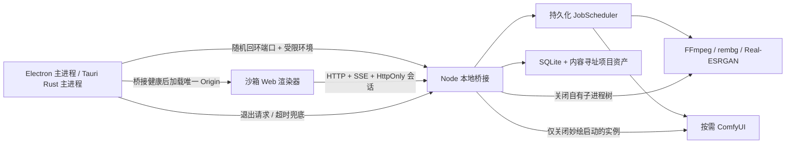

# 妙绘 — 桌面封装与发行架构

> 该文档隶属于[01-开发者文档.md 第 6 节](../01-开发者文档.md#6-模块实现)，用于补充桌面壳、sidecar、安装卸载与发行边界的可复核事实。

> **文档梗概**：记录 `REL-001` 的 Electron/Tauri 对照实现、共享本地桥接契约、桌面安全边界、真实安装卸载与资源基准，以及阶段 A 的可逆选型结论。
>
> **具体规划法则**：
>
> 1. Web 前端和本地桥接是桌面壳无关的产品内核；桌面壳不得拥有第二套业务 API。
> 2. 渲染器只访问本次启动分配的回环 Origin，不直接获得 Node、Tauri Shell、文件系统或任意进程执行能力。
> 3. 桥接、FFmpeg、NCNN、Python 与 ComfyUI 均由统一资源与进程生命周期约束；退出桌面壳后不得留下自有回环端口或孤儿进程。
> 4. 应用、Node 运行时、模型与用户项目必须分层；模型和用户数据不进入 UI 更新包。
> 5. `REL-001` 只形成封装方向和可复核实验，不等同于已经具备签名、自动更新或商业发行资格。
>
> **最后一次更新时间**：2026-08-14
>
> **更新者**：发布工程组、开发组、测试与质量保障组

---

## 1. 决策摘要

阶段 A 暂定 **Tauri 作为 Windows 个人分发候选壳，Electron 作为可随时回退的参考壳**。该选择只针对当前单机、本地优先、希望减小下载体积的产品形态：

- Tauri 已生成并真实验证 27.4 MiB 的 NSIS 安装包；Electron 当前只有 348.8 MiB 的未压缩便携目录。
- Electron 在同机三轮热缓存交替启动中更快、内存更低：窗口加载中位数 0.857 秒，进程树私有内存中位数 434.4 MiB。
- Tauri 窗口加载中位数 1.446 秒，进程树私有内存中位数 466.3 MiB；WebView2 的多进程开销使它在本机并不比 Electron 更省内存。
- Tauri 的 Node 22 sidecar 与当前项目运行时一致；Electron 43 内置 Node 24，继续采用 Electron 前必须额外完成完整项目迁移回归。
- 两条壳共享同一 React 构建、本地 HTTP API、会话安全、Job/资产/ComfyUI 逻辑，因此选型可以回滚，不需要重写创作界面。

这不是永久承诺。若 Tauri 的 WebView2 差异、sidecar 打包、工具链维护或支持成本明显高于包体收益，应切回 Electron；反向切换时不得改变项目格式和业务 API。

## 2. 共享架构



一次正常启动遵循：

1. 壳进程从 `127.0.0.1` 取得空闲随机端口，并建立独立运行目录与机器配置路径。
2. 以环境白名单启动桥接，传入 `MIAOHUI_HOST`、`MIAOHUI_PORT`、`MIAOHUI_RUNTIME_DIR` 与 `MIAOHUI_CONFIG`。
3. 轮询 `/api/health`，只有桥接可用后才创建并显示主窗口。
4. 窗口仅允许导航到本次启动的精确 Origin；新窗口、WebView、设备权限和不受控 Shell 能力被拒绝。
5. 用户关闭应用后，壳先请求桥接正常退出，等待 Job/数据库/端口收束；超时才终止自有进程树。

用户项目、配置和模型位于应用数据目录或用户显式选择的位置，不放入安装目录。当前实验仍复用既有 `config/local.json` 语义；正式发行前要补配置迁移、空间预算和卸载保留选项。

## 3. Electron 实验壳

入口为 `desktop/electron/main.mjs`。主进程使用 `utilityProcess.fork()` 启动同仓库的 `server/index.mjs`，不向页面注入 preload API。

已实现的安全约束：

- `nodeIntegration: false`、`contextIsolation: true`、`sandbox: true`、`webSecurity: true`。
- 设备和浏览器权限默认拒绝；新窗口与 WebView 禁止。
- 网络请求和导航限制到本次桥接的精确 Origin。
- 子进程只继承受控环境变量；诊断日志有长度上限并经过脱敏。
- 窗口退出时先结束 Utility Process，Windows 超时兜底才使用进程树终止。

Electron 包装器只暂存 `dist/`、`server/`、共享桥接代码和必要画布模块，并使用 Electron 包内官方 `checksums.json` 校验本地运行时归档。当前为了让 Python runner 保持真实文件路径而未启用 ASAR。

限制：

- 当前产物是未签名的便携目录，不是安装包。
- Electron 43.4.0 内置 Node 24.18.1，而开发基线是 Node 22.20.0；真实桌面生命周期已通过，但项目存储的完整故障/迁移矩阵仍需用该内置运行时复测。
- 没有实现更新器、回滚和卸载器；若后续回退到 Electron，这些属于 `REL-002` 的发布工作。

## 4. Tauri 实验壳

Tauri 入口位于 `desktop/tauri/src-tauri/`。Rust 主进程通过 Shell 插件启动一个自包含 Node 22 sidecar，等待健康检查后再创建 WebView2 窗口。

sidecar 由 `@yao-pkg/pkg` 的 SEA 模式构建：

- 输出 `miaohui-bridge-x86_64-pc-windows-msvc.exe`，大小 84.6 MiB。
- 已在仅保留 Windows 系统目录的 `PATH` 下启动，证明目标机不需要另装 Node.js。
- 父进程通过标准输入发送 `shutdown\n`；桥接关闭 HTTP、SQLite 与自有 Worker 后退出。
- 打包配置使用 Node 22 Windows x64，与当前 `node:sqlite` 项目基线一致。

Tauri 渲染器只拥有 `core:default` capability，`withGlobalTauri` 为 false，不暴露 Shell permission；导航限制到精确桥接 Origin，新窗口禁止。页面实际探针确认 `window.__TAURI__`、`process` 与 `require` 均不可见。

Windows 包采用 NSIS，WebView2 模式为 `embedBootstrapper`。安装器已在隔离的当前用户目录执行静默安装、启动、桥接退出和静默卸载，并确认程序文件、卸载注册项和开始菜单快捷方式均清理。

限制：

- 安装器未签名，Windows 信誉与企业部署体验尚不满足公开发行要求。
- 目标机仍依赖 WebView2 安装/引导成功；不同 WebView2 版本必须进入兼容性矩阵。
- `pkg` 对 `.mjs` 的静态收集会输出警告。现有真实运行已覆盖所需模块与静态资产，但长期应改为先生成可审计的单文件 bundle，或采用明确的 Node runtime + resources 方案。
- Tauri、Rust、MSVC、NSIS 与 WebView2 使构建链更复杂；工具下载必须继续固定来源与哈希。
- 自动更新、签名校验、A/B 回滚和模型包下载尚未实现。

## 5. 对照结果

以下数据来自 2026-08-14 同一 Windows 主机、同一前端构建和同一桥接功能。启动基准交替运行 Electron/Tauri 三轮，在启动 6.5 秒后采集进程树；首轮后系统缓存已热，因此它是本机相对比较，不是跨设备承诺。

| 指标 | Electron 43.4.0 | Tauri 2.11.4 + WebView2 | 判断 |
| --- | ---: | ---: | --- |
| 窗口加载中位数 | 0.857 s | 1.446 s | Electron 快约 0.59 s |
| 窗口加载范围 | 0.802–1.018 s | 1.332–1.454 s | Electron 更快，Tauri 本轮范围更窄 |
| 进程数中位数 | 5 | 9 | Tauri 包含 6 个 WebView2 进程 |
| 工作集中位数 | 623.7 MiB | 701.0 MiB | 共享页可能被重复统计，只作相对观察 |
| 私有内存中位数 | 434.4 MiB | 466.3 MiB | Electron 本机低约 31.9 MiB |
| 解包/运行文件 | 348.8 MiB | 96.2 MiB | Tauri 小约 72% |
| 可分发安装包 | 尚无 | 27.4 MiB NSIS | Tauri 已有真实安装闭环 |
| Node 运行时 | Electron 内置 Node 24.18.1 | 自包含 Node 22 sidecar | Tauri 与当前基线一致 |
| 签名/自动更新 | 未实现 | 未实现 | 均不能作为正式商业发布包 |

机器可读证据位于：

- `.runtime/qa/electron-package-final.json`
- `.runtime/qa/desktop-electron-packaged-final.json`
- `.runtime/qa/node-sidecar-final.json`
- `.runtime/qa/desktop-tauri-release-final.json`
- `.runtime/qa/tauri-installer-final.json`
- `.runtime/qa/desktop-shell-benchmark-final.json`

这些是本机 QA 产物并被 Git 忽略；文档保存结论和方法，具体数值变更时必须重新生成报告，不手工覆盖报告。

## 6. 构建与验证

开发机需要 Node.js 22。Tauri 构建还需要本机 MSVC/WebView2，并通过项目脚本加载 `.runtime/toolchains/rust` 中的项目级 Rust 工具链。

```powershell
# Electron：生产前端、最小便携目录和真实沙箱生命周期
npm run package:desktop:electron
npm run validate:desktop:electron:packaged

# Tauri：生产前端、自包含 Node 22 sidecar、Rust release 与 NSIS
npm run package:desktop:tauri
npm run validate:desktop:sidecar
npm run validate:desktop:tauri:release
npm run validate:desktop:tauri:installer

# 对已有两套 release 产物执行统一生命周期与资源对照
npm run validate:desktop:release
```

`validate:desktop:release` 会短暂创建一个隔离的当前用户安装记录并立即卸载；它拒绝覆盖已有同名安装。默认 `npm run validate` 不执行桌面安装或启动基准，以保持日常回归快速且无注册表变更。

主要产物：

| 产物 | 路径 |
| --- | --- |
| Electron 便携目录 | `.runtime/releases/electron/MiaoHui-win32-x64/` |
| Tauri release 主程序 | `desktop/tauri/src-tauri/target/release/miaohui-desktop.exe` |
| Tauri Node sidecar | `desktop/tauri/src-tauri/binaries/miaohui-bridge-x86_64-pc-windows-msvc.exe` |
| Tauri NSIS 安装包 | `desktop/tauri/src-tauri/target/release/bundle/nsis/MiaoHui_0.1.0_x64-setup.exe` |

上述二进制和 `target/` 都是可再生构建产物，不进入 Git。正式发布不能直接复制当前文件：必须先完成签名、SBOM/许可证清单、干净机兼容性和更新回滚门禁。

## 7. 下一阶段门禁

`REL-001` 的“壳选择实验”不继续膨胀为发行系统。阶段 D 的 `REL-002` 至少要补齐：

1. 代码签名、时间戳、发布密钥隔离与可验证签名。
2. 应用 A/B 或等价原子更新、失败回滚、跨版本项目迁移与降级策略。
3. 应用、Node/Python/FFmpeg/NCNN 运行时和模型包分层更新。
4. 模型下载断点续传、哈希、来源、许可、磁盘预算与损坏隔离。
5. Windows 10/11、不同 WebView2/驱动、标准用户、断网、低磁盘与杀进程恢复矩阵。
6. 卸载时明确区分程序、缓存、模型和用户项目，默认保留用户创作数据。

在这些条件完成前，只能称为“本机已验证的未签名实验安装包”，不能称为公开发行版。

## 8. 关联文档

- [00-项目总纲](../00-项目总纲.md)
- [01-开发者文档](../01-开发者文档.md)
- [02-项目规划](../02-项目规划.md)
- [12-无限画布性能与资源分级](12-无限画布性能与资源分级.md)
- [21-中长期优化路线](../02-子文档/21-中长期优化路线.md)
- [03-开发历史](../03-开发历史.md)
