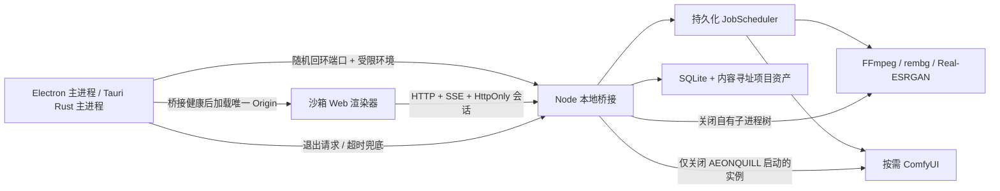

# 光阴砚 AEONQUILL — 桌面封装与发行架构

> 该文档隶属于[01-开发者文档.md 第 6 节](../01-开发者文档.md#6-模块实现)，用于补充桌面壳、sidecar、安装卸载与发行边界的可复核事实。

> **文档梗概**：记录 Electron/Tauri 壳层决策、AEONQUILL Windows x64 安装与生命周期契约，以及 `REL-004/REL-005` 的 V0.4 主安装器、完整 ComfyUI/Python/H3 离线运行时与非系统盘便携布局。
>
> **具体规划法则**：
>
> 1. Web 前端和本地桥接是桌面壳无关的产品内核；桌面壳不得拥有第二套业务 API。
> 2. 渲染器只访问本次启动分配的回环 Origin，不直接获得 Node、Tauri Shell、文件系统或任意进程执行能力。
> 3. 桥接、FFmpeg、NCNN、Python 与 ComfyUI 均由统一资源与进程生命周期约束；退出桌面壳后不得留下自有回环端口或孤儿进程。
> 4. 应用、Node 运行时、模型与用户项目必须分层；模型和用户数据不进入 UI 更新包。
> 5. `REL-001` 只形成封装方向和可复核实验，不等同于已经具备签名、自动更新或商业发行资格。
> 6. `package.json` 是阶段包版本的唯一来源；Tauri 直接读取该文件，Cargo 版本只作构建镜像并由发布契约校验。
> 7. 用户可见身份统一为 AEONQUILL；内部 Tauri identifier 暂时保留 `com.miaohui.desktop` 以避免既有数据断链，只有带迁移和回滚的独立任务才能改动。
>
> **最后一次更新时间**：2026-08-20
>
> **更新者**：发布工程组、开发组、测试与质量保障组

---

## 1. 决策摘要

`V0.4` 继续采用 **Tauri 作为 Windows x64 阶段测试包的主发行壳，Electron 作为可随时回退的参考壳**，并把小型应用安装器与超过 50 GiB 的创作运行时拆分交付。该选择只针对当前单机、本地优先的产品形态：

- AEONQUILL Tauri 已生成并由独立 QA 验证 29,055,739 bytes（约 27.7 MiB）的 NSIS 阶段测试安装包；Electron 回退壳当前为 349.4 MiB 未压缩便携目录。
- 2026-08-15 同机三轮交替启动中，Electron 窗口加载中位数 1.535 秒，进程树私有内存中位数 366.6 MiB。
- Tauri 窗口加载中位数 1.855 秒，进程树私有内存中位数 416.7 MiB；WebView2 的多进程开销使它在本机并不比 Electron 更省内存。
- Tauri 的 Node 22 sidecar 与当前项目运行时一致；Electron 43 内置 Node 24，继续采用 Electron 前必须额外完成完整项目迁移回归。
- 两条壳共享同一 React 构建、本地 HTTP API、会话安全、Job/资产/ComfyUI 逻辑，因此选型可以回滚，不需要重写创作界面。

这不是永久承诺。若 Tauri 的 WebView2 差异、sidecar 打包、工具链维护或支持成本明显高于包体收益，应切回 Electron；反向切换时不得改变项目格式和业务 API。

## 2. 共享架构



一次正常启动遵循：

1. 壳进程从 `127.0.0.1` 取得空闲随机端口，并建立独立运行目录与机器配置路径。
2. 以环境白名单启动桥接，注入 `AEONQUILL_HOST`、`AEONQUILL_PORT`、`AEONQUILL_RUNTIME_DIR`、`AEONQUILL_DATA_DIR`、`AEONQUILL_CACHE_DIR`、`AEONQUILL_LOG_DIR` 与 `AEONQUILL_CONFIG`；在兼容期同步镜像既有 `MIAOHUI_HOST`、`MIAOHUI_PORT`、`MIAOHUI_RUNTIME_DIR` 与 `MIAOHUI_CONFIG`。ComfyUI 策略、空闲秒数、图片并发、rembg 与 Real-ESRGAN 路径只在父环境明确提供时转发，新配置优先使用 `AEONQUILL_*`，旧 `MIAOHUI_*` 仅为兼容输入，不用桌面默认值覆盖 `config/local.json` 中的用户选择。
3. 轮询 `/api/health`，只有桥接可用后才创建并显示主窗口。
4. 窗口仅允许导航到本次启动的精确 Origin；新窗口、WebView、设备权限和不受控 Shell 能力被拒绝。
5. 用户关闭应用后，壳先请求桥接正常退出，等待 Job/数据库/端口收束；超时才终止自有进程树。

用户项目、配置和模型位于应用数据目录或用户显式选择的位置，不放入安装目录。桌面壳默认在应用本地数据根目录下建立同级 `runtime/`、`data/`、`cache/`、`logs/` 与 `config/`；桥接在新 data 为空而旧 runtime 存在 jobs/projects/assets/client-state 时继续使用旧持久数据并公开 `LEGACY_DATA_LAYOUT`，不静默搬移或删除。卸载器只移除应用二进制和登记，默认保留这些目录及外部 ComfyUI/模型。内部 identifier 仍沿用兼容值，待后续迁移任务完成后再切换。

## 3. Electron 回退壳

入口为 `desktop/electron/main.mjs`。主进程使用 `utilityProcess.fork()` 启动同仓库的 `server/index.mjs`，不向页面注入 preload API。

已实现的安全约束：

- `nodeIntegration: false`、`contextIsolation: true`、`sandbox: true`、`webSecurity: true`。
- 设备和浏览器权限默认拒绝；新窗口与 WebView 禁止。
- 网络请求和导航限制到本次桥接的精确 Origin。
- 子进程只继承受控环境变量；诊断日志有长度上限并经过脱敏。
- 窗口退出时先结束 Utility Process，Windows 超时兜底才使用进程树终止。

Electron 包装器只暂存 `dist/`、`server/`、共享桥接代码，以及服务端跨边界依赖的画布、像素、故事和产品壳纯逻辑模块，并使用 Electron 包内官方 `checksums.json` 校验本地运行时归档。当前为了让 Python runner 保持真实文件路径而未启用 ASAR。

限制：

- 当前产物是未签名的便携目录，不是安装包。
- Electron 43.4.0 内置 Node 24.18.1，而开发基线是 Node 22.20.0；真实桌面生命周期已通过，但项目存储的完整故障/迁移矩阵仍需用该内置运行时复测。
- `app.setName('AEONQUILL')` 会产生新的默认 userData 名称。回退壳只在 AEONQUILL 新目录尚无持久标记且旧 `MiaoHui` 目录有持久数据时继续使用旧目录；显式目录或新目录已有数据时不切换，整个过程不复制、搬移或删除。该兼容选择已有纯逻辑契约，但仍须在真正回退发行前进入跨版本人工矩阵。
- 没有实现更新器、回滚和卸载器；若后续回退到 Electron，这些属于 `REL-002` 的发布工作。

## 4. Tauri 主发行壳

Tauri 入口位于 `desktop/tauri/src-tauri/`。Rust 主进程通过 Shell 插件启动一个自包含 Node 22 sidecar，等待健康检查后再创建 WebView2 窗口。

sidecar 由 `@yao-pkg/pkg` 的 SEA 模式构建：

- 输出 `aeonquill-bridge-x86_64-pc-windows-msvc.exe`，阶段实测约 84.7 MiB。
- 已在仅保留 Windows 系统目录的 `PATH` 下启动，证明目标机不需要另装 Node.js。
- 父进程通过标准输入发送 `shutdown\n`；桥接关闭 HTTP、SQLite 与自有 Worker 后退出。
- 主窗口发出 `CloseRequested` 时，Tauri 必须显式退出应用事件循环；`run_return` 返回后才执行上述 sidecar 关闭。关闭窗口不能只销毁 WebView 并留下无界面的 desktop、sidecar 或监听端口。
- 打包配置使用 Node 22 Windows x64，与当前 `node:sqlite` 项目基线一致。

Tauri 渲染器只拥有 `core:default` capability，`withGlobalTauri` 为 false，不暴露 Shell permission；导航限制到精确桥接 Origin，新窗口禁止。页面实际探针确认 `window.__TAURI__`、`process` 与 `require` 均不可见。

Windows 包采用 NSIS 当前用户安装，WebView2 模式为 `offlineInstaller`。安装器、窗口、主程序、sidecar、开始菜单目录、快捷方式和卸载登记统一为 AEONQUILL；应用图标由用户提供的“时钟、砚台与画笔”1536×1536 PNG 等比例生成 Windows ICO 与 Tauri 全尺寸资源。安装器把安装说明、限制与第三方声明放入 `release/`。隔离验收覆盖静默安装、安装版启动、五类数据目录、桥接退出、干净 data 建库、旧 runtime 持久数据回退、两类用户数据保留和静默卸载，并确认程序文件、卸载注册项和开始菜单快捷方式均清理。`DEV-014` 后自动验收不再直接调用 `app.exit()`：QA WebView 发出真实 `window.close()`，报告必须存在 `windowCloseRequestedMs`，且 sidecar 优雅退出与端口关闭后应用才算通过。

`QA-003` 最终验收的唯一安装包为 `AEONQUILL_0.3.0_x64-setup.exe`，29,055,739 bytes，SHA-256 `8e290ec39c7982c4107945b306460299045c9eee0d7b5ccfa960b5c4da35352d`；release manifest 绑定干净源码 `642e3b9f99c8a3cc4cbd23c3f315532536f7d789`，6/6 文件校验通过，Authenticode 为 `NotSigned`。QA 枚举标题“光阴砚 AEONQUILL”、class `Tauri Window` 的真实顶层窗口并发送 `WM_CLOSE`，窗口、desktop、自有 sidecar 与随机端口在 7.937 秒内有界退出且未强杀；安装版 FFmpeg 派生、随机端口恢复、SSE 重启追平、安全与卸载保留矩阵同时通过。该源码对应 `V0.3.4`，`V0.3.5` 只是 docs-only QA 见证，不重建或替换候选哈希。

限制：

- 安装器未签名，Windows 信誉与企业部署体验尚不满足公开发行要求。
- 目标机仍依赖 WebView2 安装/引导成功；不同 WebView2 版本必须进入兼容性矩阵。
- `pkg` 对 `.mjs` 的静态收集会输出警告。现有真实运行已覆盖所需模块与静态资产，但长期应改为先生成可审计的单文件 bundle，或采用明确的 Node runtime + resources 方案。
- Tauri、Rust、MSVC、NSIS 与 WebView2 使构建链更复杂；工具下载必须继续固定来源与哈希。
- 自动更新、签名校验、A/B 回滚和模型包下载尚未实现。
- 主 NSIS 不直接捆绑大体积 ComfyUI/Python/模型树；配套完整离线目录固定包含这些依赖并通过独立 manifest 与哈希清单绑定。API Key、个人素材、缓存、未登记节点与未登记权重始终排除。
- MiniMax H3 许可存在地域、下游接受、归属、安全措施和规模化商业条件；当前完整包标记为 `unsigned-local-stage-only`，许可证、传递依赖 SBOM 和公开商业再分发结论尚未完成。
- `QA-003` 未重复执行高显存 H3，只审计既有真实产物；缺失的可选模型保持真实阻塞，`AI-001` 样本门与约 518.75 kB 主分块警告继续作为非阻断后续项。

## 5. 对照结果

以下数据来自 2026-08-15 同一 Windows 主机、同一 AEONQUILL 前端构建和同一桥接功能。启动基准交替运行 Electron/Tauri 三轮，在启动 6.5 秒后采集进程树；首轮后系统缓存已热，因此它是本机相对比较，不是跨设备承诺。

| 指标 | Electron 43.4.0 | Tauri 2.11.4 + WebView2 | 判断 |
| --- | ---: | ---: | --- |
| 窗口加载中位数 | 1.535 s | 1.855 s | Electron 快约 0.32 s |
| 窗口加载范围 | 1.206–1.839 s | 1.720–1.879 s | Electron 更快，Tauri 本轮范围更窄 |
| 进程数中位数 | 5 | 9 | Tauri 包含 6 个 WebView2 进程 |
| 工作集中位数 | 546.5 MiB | 643.0 MiB | 共享页可能被重复统计，只作相对观察 |
| 私有内存中位数 | 366.6 MiB | 416.7 MiB | Electron 本机低约 50.1 MiB |
| 解包/运行文件 | 349.4 MiB | 96.5 MiB | Tauri 小约 72% |
| 可分发安装包 | 尚无 | 27.7 MiB NSIS | Tauri 已有真实安装闭环 |
| Node 运行时 | Electron 内置 Node 24.18.1 | 自包含 Node 22 sidecar | Tauri 与当前基线一致 |
| 签名/自动更新 | 未实现 | 未实现 | 均不能作为正式商业发布包 |

机器可读证据位于：

- `.runtime/qa/electron-package-final.json`
- `.runtime/qa/desktop-electron-packaged-final.json`
- `.runtime/qa/node-sidecar-final.json`
- `.runtime/qa/desktop-tauri-release-final.json`
- `.runtime/qa/tauri-installer-final.json`
- `.runtime/qa/desktop-shell-benchmark-final.json`

这些是本机 QA 产物并被 Git 忽略；文档保存结论和方法，具体数值变更时必须重新生成报告，不手工覆盖报告。

## 6. 构建与验证

开发机需要 Node.js 22。Tauri 构建还需要本机 MSVC/WebView2，并通过项目脚本加载 `.runtime/toolchains/rust` 中的项目级 Rust 工具链。

```powershell
# Electron：生产前端、最小便携目录和真实沙箱生命周期
npm run package:desktop:electron
npm run validate:desktop:electron:packaged

# Tauri：生产前端、自包含 Node 22 sidecar、Rust release 与 NSIS
npm run package:desktop:tauri

# V0.4：固定离线运行时、完整根清单与拆分包
npm run stage:desktop:runtime
npm run package:desktop:full-offline
npm run validate:desktop:sidecar
npm run validate:desktop:tauri:release
npm run validate:desktop:tauri:installer
npm run validate:desktop:release-manifest
npm run validate:desktop:release-manifest -- --require-clean

# 对已有两套 release 产物执行统一生命周期与资源对照
npm run validate:desktop:release

# 离线运行时与包内真实执行链
npm run validate:desktop:runtime
npm run validate:desktop:comfy
npm run validate:desktop:offline-sidecar
npm run validate:desktop:offline-video
npm run validate:desktop:full-offline
```

`package:desktop:tauri` 依次生成生产前端、带固定工作流 JSON 的 Node 22 sidecar、Tauri release、NSIS 和受控 release staging；所有文件名均由 `package.json` 产品 SemVer `0.4.0` 与 Tauri 产品名动态生成。`validate:desktop:release` 会短暂创建隔离的当前用户安装记录并立即卸载；它拒绝覆盖已有 AEONQUILL 快捷方式或卸载登记，并断言真实主窗口关闭会退出应用/sidecar/端口、卸载后用户数据哨兵仍存在。正式候选必须从干净提交重建并通过 `--require-clean`。

完整离线包不是单个巨型 NSIS。`stage:desktop:runtime` 根据 `desktop/runtime/runtime-lock.json` 只复制登记的 ComfyUI 核心、两个 Custom Nodes、模型、便携 Python 与三类图片工具，明确排除 input/output/temp/user、缓存、密钥、未知节点和未知权重；生成 `runtime-manifest.json` 与覆盖 63,232 文件的 `runtime-SHA256SUMS.txt`。`stage:desktop:full-offline` 再把干净主安装器、发行说明、安装脚本和版本化运行时组合到 `.runtime/releases/offline/AEONQUILL_0.4.1_windows_x64_full/`，根 `offline-release-manifest.json` 绑定主安装器、脚本与运行时清单。

V0.4.1 双击入口默认使用 `-UsePayloadInPlace`，以完整包所在磁盘为安装盘并创建 `AEONQUILL/App` 与同级 `UserData`，因此不会把 50.28 GiB 运行时复制到 C 盘。安装器在 `App/aeonquill-layout.json` 写入只有三个固定字段的布局标记；Tauri/Rust 与 Electron/Node 均拒绝未知字段、未知布局和任意数据目录名，只允许解析到安装根同级 `UserData`。环境变量仍可覆盖该默认值以支持隔离 QA。`-MigrateLegacyData` 迁移旧 app-local-data，`-RemoveLegacyAfterMigration` 明确授权后才移动并清理空的旧根；`-ReplaceExistingApplication` 只调用登记位置内的旧 AEONQUILL 卸载器。只有 `-RepairRuntime` 才能删除经过父目录/精确目标验证的同版本运行时。

主要产物：

| 产物 | 路径 |
| --- | --- |
| Electron 便携目录 | `.runtime/releases/electron/AEONQUILL-win32-x64/` |
| Tauri release 主程序 | `desktop/tauri/src-tauri/target/release/aeonquill-desktop.exe` |
| Tauri Node sidecar | `desktop/tauri/src-tauri/binaries/aeonquill-bridge-x86_64-pc-windows-msvc.exe` |
| Tauri NSIS 安装包 | `desktop/tauri/src-tauri/target/release/bundle/nsis/AEONQUILL_<package.json version>_x64-setup.exe` |
| 阶段发布目录 | `.runtime/releases/staging/AEONQUILL_<version>_windows_x64_stage/` |

阶段发布目录包含安装包、`release-manifest.json`、JSON Schema、`SHA256SUMS.txt`、安装说明、限制和第三方声明。manifest 记录源码提交/脏状态、产品和内部 identifier、架构、字节数、应用/sidecar/安装包 SHA-256、Authenticode 实测状态、外部依赖、许可证缺口与明确排除项；禁止出现开发机绝对路径。工作树未提交时仍可生成开发候选，但正式候选必须在干净提交上重新 staging，并以 `--require-clean` 复核。

上述二进制、50.28 GiB 运行时、`.runtime/` 和 `target/` 都是可再生构建产物，不进入 Git。`REL-004` 已从 staged 运行时真实完成包内 ComfyUI 冷启动、7/7 图片处理器及固定 T2V/I2V；`REL-005` 已完成便携布局代码与单元/Rust 契约，仍须从干净 V0.4.1 提交重建、迁移到 D 盘并完成整包安装验收。当前只能交付未签名本机阶段包；正式公开发行仍必须完成签名、更新/回滚、完整第三方 SBOM/许可与地域合规、内容安全和扩大干净机/驱动矩阵。

## 7. 下一阶段门禁

V0.4 完整离线包解决“单机无系统 Python/Node 可运行”的阶段问题，不替代正式发行系统。阶段 D 的 `REL-002` 至少要补齐：

1. 代码签名、时间戳、发布密钥隔离与可验证签名。
2. 应用 A/B 或等价原子更新、失败回滚、跨版本项目迁移与降级策略。
3. 应用、Node/Python/FFmpeg/NCNN 运行时和模型包分层、增量更新；不再每次复制 50 GiB 完整树。
4. 模型下载断点续传、哈希、来源、许可接受、地域策略、磁盘预算与损坏隔离。
5. Windows 10/11、不同 WebView2/驱动、标准用户、断网、低磁盘与杀进程恢复矩阵。
6. 卸载时明确区分程序、缓存、模型和用户项目，默认保留用户创作数据。

在这些条件完成前，只能称为“本机已验证的未签名实验安装包”，不能称为公开发行版。

## 8. 关联文档

- [00-项目总纲](../00-项目总纲.md)
- [01-开发者文档](../01-开发者文档.md)
- [02-项目规划](../02-项目规划.md)
- [12-无限画布性能与资源分级](12-无限画布性能与资源分级.md)
- [21-中长期优化路线](../02-子文档/21-中长期优化路线.md)
- [03-开发历史](../03-开发历史.md)
