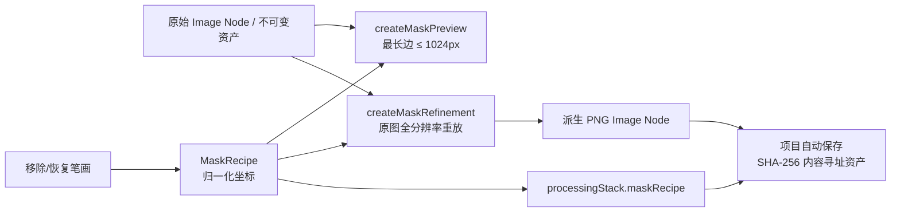
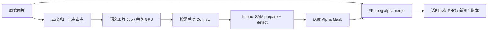
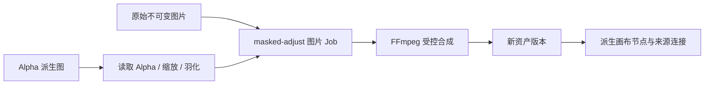

# 光阴砚 AEONQUILL — 图像算法基准与蒙版工作流

> 该文档隶属于[01-开发者文档.md 第 6 节](../01-开发者文档.md#6-模块实现)，用于说明 `AI-001` 已落地的非破坏性蒙版编辑、图像质量评测协议、候选登记和后续模型定型门禁。
>
> **文档梗概**：记录蒙版笔刷从浏览器预览到全分辨率派生资产的真实数据流，以及去背景候选在统一样本、指标、性能和返修协议下的比较方式。
>
> **具体规划法则**：
>
> 1. 合成样本只验证评测协议，不得被解释为模型质量证据。
> 2. 原始图片始终保留；蒙版笔画保存为可校验配方，正式结果保存为新的图片资产版本。
> 3. 模型代码许可证、权重许可证、二进制许可证和再分发条件必须分别核验，候选登记不等于商业许可通过。
> 4. 运行时禁止静默下载模型；新候选必须先登记、人工安装、校验文件，再进入固定样本评测。
> 5. `AI-001` 只有在四类真实样本、自动指标、显存/时延和人工返修记录全部满足门禁后才能完成。
>
> **最后一次更新时间**：2026-08-14
>
> **更新者**：开发组、算法与模型组、前端与客户端组、测试与质量保障组

---

## 1. 当前结论与完成边界

`AI-001` 已进入进行中状态，当前完成的是第一条可执行切片，不是算法定型：

- `ImageLab` 新增“蒙版修边”，提供移除/恢复 Alpha、笔刷直径、硬度、撤销和重置。
- 指针笔画保存为归一化坐标，可在最高 1024px 的预览和原图全分辨率使用同一语义重放。
- 应用后创建派生图片和处理关联线，原图不覆盖；`processingStack` 保存蒙版配方和输出来源。
- 项目自动保存会把派生 PNG 外置为 SHA-256 内容寻址资产，刷新后节点、笔画数量和处理步骤可恢复。
- 已将本机 ComfyUI Impact Pack 的 SAM v1 ViT-B 接为独立“元素提取”预览能力：前端记录正/负点击点，桥接按需启动 ComfyUI，正式输出透明元素与灰度蒙版，并沿用统一 GPU 调度、取消、重试、错误和不可变版本语义。
- 已把明确产生 Alpha 的派生图接入 `masked-adjust`：源图与派生图 Alpha 作为两个受管输入，由 FFmpeg 确定性执行主体突出、背景压暗或背景虚化，并形成新的 Job、资产版本、画布节点和来源连接；普通原图不能冒充蒙版。
- 新增图像质量评测协议、合成烟测夹具、候选登记表和门禁计算；合成报告固定显示 `incomplete`。
- 桌面 1440×900 与移动端 390×844 已验证真实拖动、应用、重开和无横向溢出；窄屏关闭的属性抽屉不再暴露到无障碍树。

仍未完成：

- 尚未建立商品、人物、插画、头发/半透明各 20 张以上的授权真实样本及人工真值。
- 尚未对 u2netp、BiRefNet、InSPyReNet、IS-Net 与 SAM 辅助流运行同批真实素材质量比较；SAM 当前只证明集成链路可执行。
- 尚未记录真实候选的 P50/P95 时延、峰值显存和人工返修时间。
- 尚未对任何新候选完成权重与发行物料的商业许可确认。
- 超分和像素化仍需建立各自的任务专用质量指标，不能直接复用 Alpha 蒙版排名。

因此当前不得宣称某个去背景模型“最佳”，不得把示例报告用于产品宣传，也不得将未审核权重封入安装包。

## 2. 蒙版编辑数据流



### 2.1 前端职责

| 位置 | 职责 | 不负责 |
| --- | --- | --- |
| `src/components/MaskEditor.tsx` | 指针归一化、实时彩色轨迹、移除/恢复模式、直径/硬度、撤销/重置、自适应画面尺寸 | 直接修改画布原图或绕过项目保存 |
| `src/components/ImageLab.tsx` | 组织处理模式、显示能力语义、提交全分辨率结果、生成本地任务状态 | 训练模型或把浏览器预览冒充服务端模型结果 |
| `src/lib/imageProcessing.ts` | 从源 Alpha 建立灰度蒙版、确定性重放笔画、返回预览/正式 PNG 和 Alpha 改变比例 | 持久化项目、分配 GPU 或联网下载 |
| `src/App.tsx` | 创建派生节点、连接线和 `ProcessingStep`，触发项目修订与自动保存 | 将笔刷中间帧写入撤销历史 |
| `src/components/Inspector.tsx` | 显示步骤数量、笔画数、Alpha 改变和启停状态 | 恢复不存在的 PSD 图层 |

指针移动期间只修改活动笔画引用和覆盖 Canvas；松开后才把完整笔画提交到 React 状态并重新生成预览。这避免每个指针点触发整页 React 更新。

### 2.2 尺寸与安全边界

| 项目 | 当前限制 |
| --- | ---: |
| 预览最长边 | 1024px |
| 正式浏览器输出 | 不超过 2400 万像素 |
| 每份配方笔画数 | 512 |
| 每份配方总点数 | 20,000 |
| 单笔点数 | 2,048 |
| 坐标 | `x`、`y` 均为 0–1 |
| 笔刷尺寸 | 短边比例 0.001–0.75 |
| 硬度 | 0–1 |

`src/lib/canvasCore.mjs` 对处理步骤、配方、笔画和点使用精确键白名单；越界坐标、未知字段、超量点数或隐藏载荷会拒绝整份画布文档。该校验既约束人工操作，也约束未来 Agent 工具。

### 2.3 处理步骤结构

当前稳定结构由 `src/types.ts` 定义：

```ts
type MaskRecipe = {
  schemaVersion: 1
  strokes: Array<{
    id: string
    mode: 'remove' | 'restore'
    size: number
    hardness: number
    points: Array<{ x: number; y: number }>
  }>
}
```

`ProcessingStep` 继续使用 `type: 'mask-refine'` 作为稳定操作 ID，并保存 `maskRecipe` 与 `outputSrc`。`outputSrc` 在当前会话可以短暂是 PNG Data URL；正式项目保存后必须成为 `/api/project-assets/<sha256>`。配方用于重放和审计，派生 PNG 用于显示和导出，两者不能互相替代。

### 2.4 SAM 点击元素提取



- 注册表固定为 `element-extract@impact-sam-v1`，输入至少 1 个正向点，正负点合计最多 32 个，坐标必须处于 0–1，阈值为 0.5–0.99。
- `runtime-stopped` 表示 Impact Pack 与 SAM 权重已存在、当前 ComfyUI 休眠；它可由正式任务按需启动，不等于依赖缺失。
- 输出包含 `outputUrl` 与 `maskUrl`，透明元素回填画布，蒙版保留供修边或后续区域编辑；失败不会覆盖原图或提交半成品。
- 当前适配使用 Impact Pack 的受控 `/sam/prepare`、`/sam/detect`、`/sam/release` 端点，不接受前端上传任意 ComfyUI 工作流。
- 本机样例已验证 1254×1254 输入、SAM 点击分割、RGBA 输出和灰度蒙版。该烟测不等于复杂发丝、透明物体或多主体质量通过。

### 2.5 确定性区域调整



- 前端只把 `element-extract`、`semantic-element-extract`、`mask-refine`、`remove-background` 或 `alpha-cleanup` 处理步骤产生的图片认作可用 Mask，同时要求 `sourceElementId`、`sourceSrc` 与当前 `src` 完整；示例原图即使保留 `sourceSrc` 也不能误入该操作。
- `effect` 只允许 `selection-highlight`、`background-dim`、`background-blur`，`strength` 为 0.1–1，`feather` 为 0–32px；未知字段、枚举和值域在写入 Job 前拒绝。
- `sourceImageDataUrl` 与 `maskImageDataUrl` 只写入受管输入目录，公开 Job 仅保留 `maskProvided: true`，不返回 Data URL、`inputPath`、`maskPath` 或 `outputPath`。
- 生成式 `region-edit` 仍由语义工作流注册表报告真实依赖状态；当前为 `template-pending`，不得以确定性 FFmpeg 合成冒充生成式重绘。

## 3. 图像质量评测协议

### 3.1 文件与职责

| 位置 | 当前职责 |
| --- | --- |
| `server/image-quality.mjs` | 严格清单校验、Alpha 指标、边界膨胀、分位数与覆盖门禁 |
| `scripts/benchmark-image-quality.mjs` | 读取清单、用 FFmpeg 解码 8-bit 灰度蒙版、聚合候选并生成 JSON 报告 |
| `benchmarks/image-quality/manifest.example.json` | 四类合成协议烟测，不代表真实模型表现 |
| `benchmarks/image-quality/fixtures/*.pgm` | 可版本化的 8×8 灰度契约夹具 |
| `benchmarks/image-quality/candidate-registry.json` | 候选用途、运行时、代码许可、权重审核状态和来源 |
| `tests/image-quality.test.mjs` | 完美/偏移/空蒙版、边界容差、分位数、严格清单与覆盖门禁 |
| `.runtime/benchmarks/image-quality/` | 用户本机真实样本、候选输出和最新报告；Git 忽略 |

评测输入是 8-bit 灰度蒙版：0 表示完全背景，255 表示完全前景，中间值表示半透明。脚本不会自动缩放候选输出；解码字节数必须与清单中的宽高完全一致，否则直接失败。

### 3.2 自动指标

| 指标 | 趋势 | 解决的问题 |
| --- | --- | --- |
| `alphaMae` | 越低越好 | 全部像素的连续 Alpha 平均绝对误差 |
| `binaryIou` | 越高越好 | 阈值化前景的交并比 |
| `precision` / `recall` / `f1` | 越高越好 | 误保留与误删除的平衡 |
| `boundaryPrecision` / `boundaryRecall` / `boundaryF1` | 越高越好 | 给定像素容差内的轮廓匹配 |
| `boundaryAlphaMae` | 越低越好 | 真值边界带内的连续 Alpha 误差 |
| `backgroundLeakage` | 越低越好 | 真值全透明区域中残留的预测 Alpha |
| `foregroundOpacityError` | 越低越好 | 真值全不透明区域中丢失的预测 Alpha |

每个指标、时延、峰值显存和返修时间统一输出 `min`、`mean`、`p50`、`p95`、`max`。分位数使用确定性线性插值；同一报告不得混用其他定义。

自动指标只帮助定位差异，不能替代人工返修时间。头发、毛发、玻璃、阴影和半透明边缘即使二值 IoU 很高，也可能仍需大量修复。

### 3.3 覆盖门禁

正式去背景候选评审必须同时满足：

1. `product`、`portrait`、`illustration`、`hair-translucent` 四类各至少 20 个真实授权样本。
2. 每个候选在每类都必须有至少 20 个预测结果，不能通过缺失困难样本提高均值。
3. 每个预测必须有至少一条人工返修秒数记录。
4. 清单必须记录候选运行时延和峰值显存；设备、分辨率、执行器版本另随评测批次归档。
5. 候选代码、权重、二进制和再分发许可必须有独立审核结论。

`assessImageQualityCoverage()` 只在前三项机器可判定条件全部成立时返回 `gateReady: true`。许可仍由候选登记和发布物料审查负责，不能由数值报告替代。

## 4. 候选登记与许可边界

`benchmarks/image-quality/candidate-registry.json` 当前登记：

| 候选 | 定位 | 当前状态 |
| --- | --- | --- |
| rembg/u2netp | 现有全自动去背景基线 | 仅本机白名单评测；权重发行条件仍需逐项复核 |
| BiRefNet | 复杂边界质量候选 | 研究评测前置，禁止自动下载或封包 |
| InSPyReNet | 高分辨率显著物体候选 | 研究评测前置，禁止自动下载或封包 |
| IS-Net / DIS | 通用高分辨率候选 | 研究评测前置，模型文件单独审核 |
| SAM v1 ViT-B | 点击辅助蒙版 | `impact-sam-v1` 预览适配已完成并真实烟测；与全自动去背景保持独立入口，质量/许可门禁仍未完成 |
| Real-ESRGAN NCNN | 超分基线/候选执行器 | 写实、动漫/视频与像素画必须分组评测 |

登记表中的 `codeLicense` 只描述官方仓库代码，不代表关联权重、导出 ONNX、便携二进制或训练数据已经获得商业再分发许可。`commercialStatus` 在完成物料审查前保持 `benchmark-only` 或 `research-only`。

## 5. 执行与报告

在项目根目录执行：

```powershell
# 合成协议烟测；正常结果必须明确显示 incomplete
npm run benchmark:image-quality:smoke

# 正式门禁；默认读取 .runtime/benchmarks/image-quality/manifest.json
npm run benchmark:image-quality
```

第一次建立本机真实样本目录时，可把 `benchmarks/image-quality/manifest.example.json` 复制到 `.runtime/benchmarks/image-quality/manifest.json`，再替换为真实样本、真值和候选结果。蒙版路径必须使用清单目录内的正斜杠相对路径，禁止绝对路径和 `..`。

默认报告写入 `.runtime/benchmarks/image-quality/latest.json`。覆盖不足时，正式命令返回失败；只有显式 `--allow-incomplete` 的协议烟测允许成功退出。

## 6. 验证结果

截至 2026-08-14：

- `npm run test:unit` 通过 75/75；其中包括蒙版配方、图像质量协议、语义工作流注册、双输入图片请求白名单和私有 Mask 路径脱敏。
- `npm run validate:semantic-api` 在隔离运行时目录完成真实 Impact SAM 冷启动、点击分割、透明 PNG/灰度蒙版双输出、Job 用量/版本记录和运行时关闭。
- `npm run validate:masked-edit` 在隔离桥接完成能力探测、缺 Mask 400、真实 1254×1254 双输入合成、SSE 快照、运行中取消、保留双输入重试、公开 Job 脱敏和 PNG 资产读取。
- `npm run benchmark:image-quality:smoke` 成功比较合成完美/偏移蒙版，并正确报告门禁未完成。
- `npm run typecheck` 与 `npm run build` 通过。
- `npm run validate:browser` 在系统 Edge 通过桌面 1440×900 与移动端 390×844。
- 浏览器真实验证了绘制后 Alpha 改变、撤销/重置启用、应用按钮启用、派生节点/连接线创建、服务端外置和刷新恢复；另完成 `SAM → Alpha 派生图 → 背景压暗 → 新版本 → 重载恢复` 的真实纵向链路。
- 移动端关闭属性抽屉时使用 `visibility: hidden` 与 `pointer-events: none`，不再向键盘、无障碍树和自动化暴露离屏控件。

这些结果证明工作流和评测协议可执行，不证明任何真实模型已经达到生产质量。

## 7. 下一轮实施顺序

1. 建立真实样本的授权、匿名化、真值制作和审阅者返修记录模板。
2. 先跑现有 u2netp 基线，再接一个质量候选；不得一次接入全部模型。
3. 为 SAM 增加框选转点击、连通区域筛选、蒙版膨胀/收缩/羽化与边缘视图；继续保持独立辅助流，不把它当作零提示全自动去背景。
4. 增加蒙版膨胀、收缩、羽化和边缘视图；这些确定性操作继续保存为配方。
5. 为超分建立写实、插画/动漫、像素画三组指标；为像素化建立调色板、轮廓和可编辑性指标。
6. 收集至少两名审阅者的返修时间，报告审阅者差异，不用单一总分掩盖类别退化。
7. 只有统一报告和许可审查均通过后，才把候选加入产品默认处理器或桌面模型包。

## 8. 维护反例

- **错误**：把烟测中的 `contract-perfect` 结果写成模型达到 100%。  
  **正确**：它只证明读取、指标和聚合协议正确。
- **错误**：为了跑分自动把预测蒙版缩放到真值尺寸。  
  **正确**：尺寸不一致直接失败，由执行器在生成阶段保证契约。
- **错误**：只比较 IoU 后选择模型。  
  **正确**：同时看连续 Alpha、边界、泄漏、P50/P95、VRAM 和返修时间。
- **错误**：看到官方代码使用宽松许可证就把任意权重封包。  
  **正确**：代码、权重、二进制、素材和再分发条件逐项审核。
- **错误**：把蒙版输出覆盖原始图片。  
  **正确**：保留原资产、配方、派生 PNG 和父子来源。
