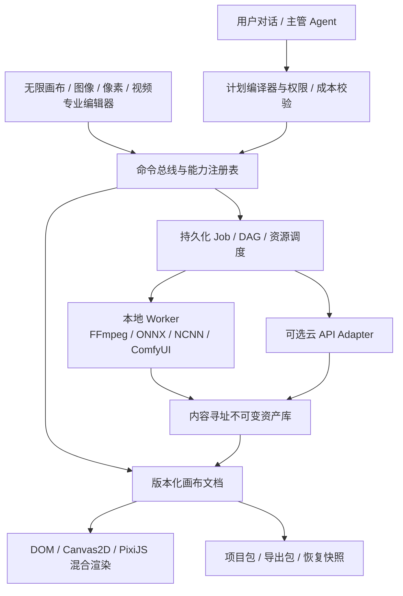

# 妙绘 — 中长期优化路线

> 该文档隶属于[02-项目规划.md 第 7 节](../02-项目规划.md#7-中长期优化路线)，用于维护妙绘从当前单机原型走向可分发、可验证和可商业化产品的阶段路线、质量门禁和决策依据。

---

## 1. 路线定位与规划口径

本路线以当前 `0.1.0` 工作区基线为起点，不把已完成原型误写为已发布产品，也不在用户尚未确认时虚构数字版本、截止日期、价格或法律结论。文中的“建议投入窗口”仅用于表达依赖和体量，不是正式工期承诺。

| 事项 | 当前路线口径 |
| --- | --- |
| 产品形态 | 推荐先做“本地优先的单人创作工作台”，再叠加可选云 API 与多 Agent |
| 价值切口 | 推荐先验证角色/商品图的去背景、像素化、人工修正、Sprite 导出与视频衍生 |
| 分发形态 | Windows 个人软件优先；Web 保留为界面形态，不假设浏览器本地存储能承担完整项目数据 |
| 收费方向 | 推荐“本地功能权益 + 云端生成额度”混合方式；定价仍需真实成本和用户验证 |
| 非近期目标 | 公开 Custom Node 市场、大规模 GPU 集群、多人协作、完整 Photoshop 替代品 |

中长期决策遵循六条原则：

1. **先纵向闭环，后横向增加按钮**：每轮先让一条真实工作流可用，不以工具数量作为进度。
2. **人和 Agent 共用同一命令层**：没有先成为可校验命令的人工操作，不对 Agent 开放。
3. **像素资产不覆盖**：所有改变图像或视频的操作都生成可追溯版本，画布只保存引用。
4. **本机算法、本机模型与云 API 可替换**：用统一能力契约屏蔽执行器，不让 UI 绑定某个供应商。
5. **任意 ComfyUI 图不等于产品工作流**：只发布经过白名单、参数限制、资源预算和回归验证的模板。
6. **性能与架构重写由数据触发**：`PERF-001` 已证明当前 331 元件夹具可继续使用 DOM 主画布；只有高密度图片、像素或动画连续超过门槛时才引入 PixiJS/WebGL 子场景。

## 2. 北极星工作流与产品边界

首个推荐的北极星工作流是：

```text
导入角色或商品图
→ 去背景 / 修边 / 裁剪
→ 像素化或常规图像增强
→ 调色板、蒙版或像素级人工修正
→ 生成或组织方向帧 / 参考帧
→ Sprite Sheet 或 720P 视频交付
→ 带来源、参数和版本的导出包
```

这条链路同时检验妙绘的四个差异化能力：无限画布上的上下文、确定性图像算法、像素画人工终修，以及受控本地生成。

辅助工作流按以下顺序验证：

1. **视频衍生**：文本或首帧/末帧 → 导演参数 → 本机 H3 → 720P 后处理 → 画布回填。
2. **通用图像批处理**：多选图片 → 统一去背景/超分/色彩 → 结果比较 → 批量导出。
3. **自然语言工具编排**：选中对象 → 计划预览 → 草稿执行 → 用户确认 → 正式提交。

近期不使用“Agent 数量”、“模型数量”或“按钮数量”作为北极星指标。建议关注：

| 指标 | 定义 | 阶段用途 |
| --- | --- | --- |
| 首个可用资产时间 | 从新建项目到首次成功导出的时间 | 判断上手难度和工作流摩擦 |
| 纵向链路完成率 | 用户不离开妙绘完成北极星工作流的比例 | 决定是否继续扩功能 |
| 人工返修时间 | 模型/算法结果到可交付之间的修正时间 | 评估图像和像素算法的真实价值 |
| 可恢复失败率 | 任务失败后可通过重试、降档或恢复项目继续工作的比例 | 衡量本机运行时的产品可靠性 |
| 单次有效交付成本 | 本地计算、云 API、存储、失败重试和支持成本的总和 | 决定价格与额度模型 |

## 3. 目标技术分层



| 分层 | 长期要求 | 当前到目标的关键变化 |
| --- | --- | --- |
| 文档层 | Schema 版本、迁移、统一命令、局部历史、草稿分支 | 从 React 状态和 `localStorage` 直写转为可测试文档内核 |
| 资产层 | 文件哈希、父版本、来源、缩略图、引用计数、安全回收 | 从 Data URL/路径耦合转为本地 SQLite 元数据 + 文件资产；Web 退化方案用 IndexedDB/OPFS |
| 任务层 | 幂等、资源类型、优先级、恢复、超时、取消、重试、费用与输出版本 | 把已有图片/视频 Job 升级为通用资源感知调度器 |
| 执行层 | 编程算法、本机模型、ComfyUI、云 API 共用契约 | 将执行器与 HTTP 路由、界面参数解耦 |
| 渲染层 | 视口裁剪、缩略纹理、热区交互、专业子编辑器 | 先给 DOM 画布建基准，只迁移高密度图像/像素内容到 GPU 渲染 |
| 封装层 | 渲染器沙箱、受控 IPC、sidecar 生命周期、签名更新、独立模型包 | 用 Electron/Tauri 决策实验替代直觉选型 |
| 云控制面 | 账号、权益、成本账本、对象存储、限流与审计 | 仅在单机工作流完成率和付费意愿已验证后投入 |

## 4. 阶段路线与退出门禁

各阶段可做预研，但不得越过关键依赖进入大规模实施。建议投入窗口基于小型开发团队，仅表示相对体量。

### 4.1 阶段 0：基线治理与可恢复开发

**建议投入窗口**：2–3 周。

**目标**：让当前原型成为可持续改造的可验证基线。

- 由用户选择恢复现有 Git 或初始化新历史，不伪造旧提交。
- 建立类型、构建、服务契约、图片处理、视频工作流、生命周期和浏览器烟测的一键验证。
- 保留一套可匿名化的小型回归项目、图像、蒙版、像素结果和视频结果。
- 给本地桥接增加随机会话凭据、Origin 白名单、CSP、路径边界和日志脱敏基线。
- 为强制结束桥接/ComfyUI/FFmpeg 进程的情况建立恢复测试。

**退出门禁**：

- 一条命令可运行静态检查、服务端契约和无模型测试。
- 一条命令可验证本机图片工具；有 H3 环境时可额外验证视频。
- 强制终止后再启动，已完成资产不丢失，运行中 Job 被正确恢复或标记为可操作失败。
- 不再把“手工点过一次”作为后续重构的唯一保护。

### 4.2 阶段 A：产品级创作内核

**建议投入窗口**：4–6 周。

**目标**：把画布、资产和 Job 从页面功能提升为可扩展平台内核。

- 完成 `Command` 、`ToolDefinition` 和参数 Schema，用户操作、快捷工具和 Agent 最终走同一执行口。
- 为画布文档加入 schemaVersion、迁移夹具、测试样本和项目导入/导出。
- 以 SQLite 存元数据，以文件系统存哈希寻址资产，实现版本、缩略图、引用计数和安全回收。
- 当前已把图片与视频统一为 CPU/GPU 资源任务，支持优先级、幂等、超时、取消和崩溃恢复；云执行阶段再增加网络、磁盘资源池与配额。
- 已建立画布性能基准并完成视口裁剪、缩略图分级、空间索引、相机帧合并与 Canvas 小地图；报告和后续触发条件见[12-无限画布性能与资源分级](../01-子文档/12-无限画布性能与资源分级.md)。
- 已完成 Electron/Tauri 短周期决策实验：暂定 Tauri + 自包含 Node 22 sidecar 为个人分发候选，Electron 为可逆回退壳；本阶段没有把未签名实验安装包冒充正式发布渠道。

**退出门禁**：

- 北极星项目可保存、关闭、重开、导出和导入，节点、资产、版本关系无丢失。
- 所有正式图片/视频操作有幂等键、输入版本、参数快照和输出版本。
- 画布基准未超过第 6 节的初始性能门槛；若超过，已用数据形成混合渲染决策，而非全量重写。
- 桌面壳实验能启动桥接和受控 sidecar、转发进度、取消子进程并完成一次安装/卸载。

### 4.3 阶段 B：专业创作链路

**建议投入窗口**：6–10 周。

**目标**：让用户真正完成“输入素材 → 人工可控编辑 → 开发/发布可用资产”。

- 图像编辑增加蒙版笔刷、边缘修复、裁剪/调整参数栈、批处理和高清导出。
- 完成去背景、超分和像素化候选的统一基准，以返修时间而非模型热度定型。
- 像素编辑器增加图层、帧、洋葱皮、选区、翻转、调色板锁定、Sprite Sheet 导入/导出和动画预览。
- 视频流引入可版本化的预设注册表、显存前检、OOM 降档、中间结果保留和统一 720P 交付。
- 整理界面信息密度，建立统一参数、错误、任务和预设组件，补齐键盘与可访问性。

**退出门禁**：

- 内部样本中的北极星链路完成率达到第 6 节门槛，且失败均有重试、降档或人工修正路径。
- 像素结果可带调色板、帧序、原点和帧率元数据导出，并被独立测试项目正确读取。
- RTX 4060 8GB 安全档在固定回归集上达到视频成功率门槛，且不会与图片 GPU 任务并发抢占。
- 5 名目标用户中至少 4 名在无现场指导下完成一条纵向链路，否则继续优化而不进入 Agent 扩张。

### 4.4 阶段 C：受控 Agent 与工作流编排

**建议投入窗口**：8–12 周。

**目标**：让 Agent 提高已稳定工具的组合效率，不使 Agent 取代数据、权限或产品规则。

- 建立带输入/输出 Schema、风险级别、成本估算、超时和重试规则的工具注册表。
- 主管 Agent 只返回计划；工作流编译器校验对象版本、权限、能力可用性、费用和资源。
- 只把选中对象、必要邻域、缩略图和相关参数投影给模型，限制隐私外发和上下文成本。
- 计划在草稿分支执行，用户接受后才经命令层提交到正式画布。
- 保留提示词、工具版本、输入资产、输出资产、费用和用户决策的 provenance。

**退出门禁**：

- 固定 Agent 场景集上计划 Schema 合格率达标，未授权正式画布写入为 0。
- 同一计划在锁定输入和确定性工具上可重放，外部生成差异有明确来源。
- 用户能在执行前看到步骤、预计费用和会修改的对象，并可删除单步。
- Agent 故障不影响手工工具、项目打开和本地处理。

### 4.5 阶段 D：商业 Beta 与个人分发

**建议投入窗口**：8–12 周。

**目标**：在小规模真实用户中验证安装、创作、更新、付费、故障恢复和许可边界。

- 定型桌面壳，完成签名安装包、分阶段更新、回滚、崩溃日志和诊断包。
- 应用程序、本地运行时和大模型包分开发布；模型包使用可审计清单、哈希、来源和许可证。
- 以 5–10 名设计伙伴验证一个主要场景，不同时验证所有设计人群。
- 先建立成本账本、权益和额度语义，再选账号、支付和订阅供应商。
- 完成依赖、模型、权重、Custom Node、字体和示例素材的许可证物料清单，关键条款交专业法律人员复核。

**退出门禁**：

- 新用户在干净 Windows 环境可完成安装、能力检测、可选模型下载、北极星工作流和卸载。
- 应用更新不覆盖项目、模型或用户配置，更新失败可回滚。
- 商业发布清单中每个二进制、模型和素材都有版本、来源、哈希和许可状态。
- 是否扩大投入由真实留存、纵向链路使用和付费意愿决定，不由已实现功能数量决定。

### 4.6 阶段 E：证据驱动的规模化

**投入方式**：不预设日期，只在阶段 D 的用户证据满足触发条件后启动。

可选方向包括云同步、版本历史、团队空间、Yjs/CRDT 多人协作、云 GPU 调度、组织账号、工作流市场和企业审计。

启动条件至少包括：

- 单人项目的活跃、复用和付费数据证明用户在长期保存资产。
- 真实用户反复表达跨设备或团队同步需求，而不是由产品端猜测。
- 资产存储、权限、冲突、备份、删除和数据地域已有专门设计。
- 云资源成本与客单价关系可持续。

## 5. 专项优化路线

### 5.1 无限画布与交互内核

1. 画布文档、命令和历史已形成可测试纯函数边界；相机与选择仍在 React 组合层，后续按真实复杂度继续拆分。
2. 空间索引、视口外裁剪、分级缩略图、相机帧合并和 Canvas 小地图已经落地，并由桌面/窄屏固定报告约束。
3. 当前给文字、形状和轻量节点保留 DOM 可编辑性；只有高密度图像、像素和动画达到性能触发条件时才实验 PixiJS 子场景。
4. 将大图滤镜、缩略图和像素数据处理放到 Worker/OffscreenCanvas，主线程只承担交互。
5. 在任何渲染层替换前固定文档和命令契约，避免 UI 重写与数据重写同时发生。

### 5.2 图像处理与蒙版

- 将裁剪、旋转、色彩调整保存为非破坏性参数栈，预览与最终输出共用同一参数语义。
- 蒙版作为独立版本资产，笔刷操作保存局部差异，支持膨胀、收缩、羽化和边缘视图。
- 去背景样本集按商品、人物、插画、头发/半透明分类；记录时延、显存、边界质量和人工返修时间。
- 超分区分写实图像、插画/动漫、像素画三类；像素画默认不走会改变轮廓的写实超分。
- 每个算法有“快速预览”和“正式输出”两级，且不允许用预览结果冒充正式资产。

### 5.3 像素画与游戏资产

- 内部格式使用图层 × 帧的二维结构，存储索引色或压缩块差异，不把单个像素建成画布节点。
- 调色板是一等对象，支持锁定、替换映射、色数检查和透明色约定。
- 像素化处理器拆成采样、量化、抖动、边缘/透明清理四段，可独立替换和基准。
- Sprite 导出元数据至少包含帧矩形、方向、动作、时长、原点、命名与透明约定。
- Tileset、Dual-grid 和引擎原生插件只在 Sprite 管线稳定后开始。

### 5.4 视频与 ComfyUI 运行时

- 继续使用固定 API 工作流而不对前端暴露任意节点图，为模板增加版本、契约、显存档位和回归样本。
- 将运行时状态明确为 `off → starting → ready → busy → idle → stopping` 并覆盖崩溃、占用端口、外部 Comfy 和无法关闭等边界。
- 在提交前估算分辨率、帧数、步数、模型与后处理的 VRAM 风险，给出安全、平衡和高显存档。
- 保留输入缩略图、工作流版本、随机种、导演参数和 FFmpeg 交付参数，支持可解释重现。
- 进度区分冷启动、下载/加载、队列、节点、采样、编码和回填；对未知节点只报节点进度，不伪造精确百分比。
- 与图片 GPU 任务共用容量为 1 的优先级调度队列；后续在多模型/多卡阶段升级为可量化显存预算。

### 5.5 Agent 与多步工作流

- 工具层先支持手工调用、快捷操作和回放，然后才生成 Agent Schema。
- 工具分为纯查询、画布草稿变更、本地计算、外部付费调用和高风险导出五级。
- 主管 Agent 不持有文件系统或数据库凭据；执行器为每步生成最小权限上下文。
- 多 Agent 只用于任务边界真正独立的规划、视觉审核、版式或素材任务，不为了展示而强制多角色。
- 默认保留计划审批与费用上限；小额确定性操作才可由用户显式开启自动执行。

### 5.6 桌面封装、模型包与更新

Electron 与 Tauri 不在路线阶段直接定型，而是使用同一个决策实验比较：

1. 安装包大小、冷启动、空闲内存和开发复杂度。
2. 启动 Node 桥接、Python/FFmpeg/NCNN/ComfyUI sidecar，传递进度并可靠终止整个进程树。
3. 渲染器沙箱、IPC 白名单、本地文件授权、诊断日志和崩溃隔离。
4. 应用签名、增量/全量更新、失败回滚、用户项目与模型不被更新器覆盖。
5. 独立模型管理器对大文件断点续传、哈希验证、镜像源、可用空间和卸载的支持。
6. 干净 Windows 虚拟机的安装、升级、降级、卸载和残留扫描。

`REL-001` 已形成阶段性结论：**Tauri 作为个人分发候选，Electron 作为回退壳**。Tauri 的 Node 22 sidecar 与现有项目运行时一致，运行文件 96.2 MiB，并已生成和真实验证 27.4 MiB NSIS；Electron 便携目录为 348.8 MiB，但窗口加载和私有内存更优。两者共享 Web/桥接内核，因此该结论可以根据真实支持成本回滚。

当前实验没有实现签名、自动更新或真实版本回滚；这些仍属于 `REL-002`。完整方法、三轮数据、安全边界和构建命令见[13-桌面封装与发行架构](../01-子文档/13-桌面封装与发行架构.md)。

### 5.7 云端、账户与商业控制面

- 先定义权益、额度、费用事件和退还语义，不让支付供应商的数据模型反向决定产品。
- 云 API Adapter 与本机执行器共用任务契约，另外记录供应商请求号、费用、数据地域、保留和删除状态。
- 首个云控制面只需账号、权益、Job 账本、私有对象存储和限流，不直接承担协作编辑。
- 云同步与多人协作属于后续证据驱动功能；二进制资产始终通过对象存储同步，不经 CRDT 传输。

## 6. 质量指标与基准矩阵

下表是跨阶段质量门槛。画布交互、文档资产和 Job 可靠性已经有首轮实测；其余领域仍是待达成目标。门槛调整必须记录基准机型、样本和原因。

| 领域 | 固定场景 | 建议初始门槛 |
| --- | --- | --- |
| 画布交互 | 300 个轻量节点 + 30 个 4K 图像缩略节点，1080P 视口持续平移/缩放 | 帧时间 P95 ≤ 20ms，指针反馈 P95 ≤ 50ms，无持续内存增长 |
| 文档与资产 | 连续 100 轮编辑/保存/关闭/重开，含复制、删除和派生版本 | 节点和引用资产丢失为 0；未引用资产只经明确回收任务删除 |
| Job 可靠性 | 重复提交、运行中取消、强杀进程、服务重启和磁盘空间不足 | 幂等重复不产生第二份正式输出；UI 500ms 内显示取消意图；自有子进程 5s 内退出 |
| 图像质量 | 商品、人物、插画、头发/半透明每类至少 20 张内部样本 | 统计边界质量、P50/P95、VRAM 和人工返修时间；候选定型必须在至少两类样本显著改善真实返修 |
| 像素资产 | 不同色数、透明边和轮廓的固定角色集 | 色数约束准确，透明色不污染，轮廓评分可回归，Sprite 元数据被测试项目 100% 正确读取 |
| 4060 视频 | RTX 4060 8GB 安全档固定 10 次文生与 10 次图生回归 | 任务完成率 ≥ 90%；因显存预检可提前拦截风险配置；交付文件可解码、可 seek、分辨率与时长正确 |
| 用户可用性 | 5 名目标用户首次使用北极星工作流 | 至少 4 人无现场指导完成；所有失败点按发生率与严重度进入排序 |
| Agent 安全 | 100 个含无效对象、过期版本、不可用工具和成本超限的场景 | 计划 Schema 合格率 ≥ 95%；未经用户确认的正式画布变更为 0；越权工具执行为 0 |
| 商业发布 | 干净系统安装、升级、断网、低磁盘、模型损坏、卸载 | 项目数据无损坏；模型哈希失败不进入可用状态；更新可回滚；许可物料清单完整率 100% |

质量评审必须同时看三类结果：机器指标、可视化差异，以及用户完成任务的时间/返修。单一 PSNR、单张演示图或一次成功生成均不足以通过门禁。

`PERF-001` 首轮结果：真实 3840×2160 源资产被 30 个图片节点复用，另有 300 个轻节点；Edge 桌面/窄屏帧 P95 均为 4.3ms，指针反馈 P95 为 4.8/4.4ms，平移后挂载 46/27 个画布节点，总 DOM 348/279，受管原图解码为 0。该结果通过当前门槛，因此渲染决策为继续 DOM 主画布；完整环境、局限和 GPU 子场景触发条件见[性能子文档](../01-子文档/12-无限画布性能与资源分级.md)。

`REL-001` 首轮结果：Electron/Tauri 三轮交替启动的窗口加载中位数为 0.857/1.446 秒，进程树私有内存中位数为 434.4/466.3 MiB，运行文件为 348.8/96.2 MiB；Tauri 27.4 MiB 未签名 NSIS 已完成隔离安装、应用启动和卸载清理。该数据只用于同机相对选择，不替代 Windows 兼容性、签名和更新回滚门禁。

## 7. 商业化与发布策略

1. **先卖可交付结果，不卖模型列表**：付费页应描述用户能完成的资产链路、本地能力、云额度和硬件要求。
2. **应用、运行时和模型分层分发**：避免每次 UI 更新重下载数 GB 模型，也方便用户主动删除不需要的能力包。
3. **本地权益与云成本分开**：本地画布、像素与确定性工具作为软件权益；云 API/GPU 使用可计量额度。
4. **先实验后定价**：记录每类 Job 成功率、延迟、重试、供应商费用、存储和支持成本，再确定订阅、买断或混合价格。
5. **离线可用但不隐瞒限制**：本地能力应在断网下继续工作；需许可刷新或云 API 的能力明确标识。
6. **数据出境可见**：任何把素材发往第三方的工具都在提交前显示供应商、用途和数据处理说明。
7. **许可证是发布输入**：代码、模型权重、训练数据声明、Custom Node、字体、模板和示例素材分别登记。

## 8. 主要风险与刹车机制

| 风险 | 早期信号 | 处理方式 |
| --- | --- | --- |
| 功能扩张快于内核稳定 | 同一操作在 UI、快捷工具和 Agent 各有一套代码 | 冻结新工具，先收敛命令与资产契约 |
| 画布重写失控 | 尚无固定基准就开始全量 WebGL 迁移 | 保持文档层稳定，只替换已被性能数据证明的热点 |
| 本机 GPU 环境碎片化 | 同一预设在不同驱动/显存上频繁 OOM | 启动前能力检测、安全档、降档链、运行时诊断包 |
| 模型与节点许可不明 | 只登记仓库 License，没有登记权重或素材条款 | 未完成物料清单的能力不进商业包 |
| 本地端口或 Custom Node 成为代码执行入口 | 网页可无凭据调用回环 API，或工作流允许未知节点 | 会话凭据、Origin 白名单、节点/参数白名单、最小权限子进程 |
| 项目数据丢失 | 资产仍依赖 Data URL、临时目录或单份 JSON | 不可变资产、原子写入、自动快照、恢复测试和项目包导出 |
| 云 API 锁定或毛利失控 | UI 直接使用供应商参数，失败重试没有账本 | 能力契约、Adapter、预算和每 Job 成本/退还事件 |
| 用户看到“很多”但不会用 | 工具栏快速增长，北极星完成率不升 | 优先工作流入口、情境工具栏、渐进参数与模板，暂停新类别 |

## 9. 持续运作节奏

- **每周一次纵向演示**：只演示从输入到导出的可使用链路，同时记录失败、等待和返修。
- **每两周一次质量回归**：固定样本、基准机型和报告格式；任何模型/算法替换必须与现基线并列。
- **每阶段一次门禁评审**：只有退出条件达成才解锁下一阶段的大规模实施。
- **每次能力变更同步三类信息**：用户可见行为、开发者契约、许可/模型物料。
- **待办不越过在制品上限**：同一阶段最多同时开启一个内核改造、一个用户链路和一个质量工作项，降低数据层和 UI 层同时失稳的风险。
- **版本、日期与责任人继续手动确认**：本路线给出顺序和门禁，不自动冒充正式排期。

## 10. 待决策门

| 决策 | 最晚决策点 | 默认工作假设 |
| --- | --- | --- |
| 首批付费用户 | 阶段 B 开始前 | 独立游戏/视觉创作者，首先验证角色与商品资产链路 |
| 正式数字版本与日期 | 创建首个发布周期前 | 仅使用阶段名，不自动分配数字版本 |
| Electron 或 Tauri | 已于 `REL-001` 完成首轮决策 | 暂定 Tauri 为个人分发候选、Electron 为回退；若 WebView2/sidecar 支持成本高于包体收益则回滚 |
| DOM 或混合 GPU 画布 | 已于 `PERF-001` 完成首轮决策 | 保留 DOM 主画布；1500+ 同时可见图片/像素精灵或动画场景连续超门槛时，仅实验热点 PixiJS/WebGL 子场景 |
| 本地模型组合 | 阶段 B 算法定型前 | 保留 FFmpeg、u2netp、Real-ESRGAN 当前基线，候选只进基准不默认入包 |
| 收费形式与支付供应商 | 阶段 D 设计伙伴测试中期前 | 本地权益 + 云额度；不设置价格 |
| 运营地区与数据地域 | 选择云 API、账户或对象存储前 | 本地优先，不假设已满足任何地区的正式合规要求 |
| 多人协作 | 阶段 E 启动前 | 不开发，等待跨设备/团队需求证据 |

## 11. 官方技术依据

- [Electron 进程模型](https://www.electronjs.org/docs/latest/tutorial/process-model)：主进程、渲染进程和 Utility Process 的职责边界。
- [Electron 沙箱](https://www.electronjs.org/docs/latest/tutorial/sandbox)与[Electron 更新](https://www.electronjs.org/docs/latest/tutorial/updates)：桌面端安全和更新实验的基线。
- [Tauri 外部二进制/Sidecar](https://v2.tauri.app/develop/sidecar/)与[Tauri Updater](https://v2.tauri.app/plugin/updater/)：对比封装方案的外部进程和更新能力。
- [PixiJS 性能建议](https://pixijs.com/8.x/guides/concepts/performance-tips)：精灵批处理、裁剪、纹理、文本、蒙版与事件热区的性能边界。
- [ComfyUI 服务端路由](https://docs.comfy.org/development/comfyui-server/comms_routes)：`/prompt` 队列提交、校验错误与 `/ws` 实时通信契约。
- [SQLite 适用场景](https://www.sqlite.org/whentouse.html)：桌面应用元数据和应用文件格式的存储依据。
- [OPFS](https://developer.mozilla.org/en-US/docs/Web/API/File_System_API/Origin_private_file_system)：仅作为 Web 退化存储候选；其存储配额、清理和按源隔离与桌面项目文件不同。
- [Yjs 官方文档](https://docs.yjs.dev/)：仅用于阶段 E 的本地优先/CRDT 协作候选，不传输二进制资产。
