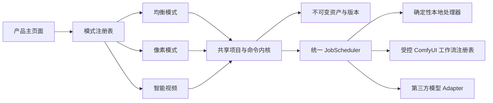

# 光阴砚 AEONQUILL — 三模式与项目对接架构

> 该文档隶属于[02-项目规划.md 第 2 节](../02-项目规划.md#2-目标产品架构)，用于定义品牌、三模式边界、共享契约、长期工作组、隔离工作树与首轮集成顺序。
>
> **最后一次更新时间**：2026-08-14  
> **更新者**：主开发、项目统筹与产品规划组

---

## 1. 品牌锁定与兼容边界

- **中文名**：光阴砚
- **英文名**：AEONQUILL
- **品牌语一**：以光为墨，以时为卷。
- **品牌语二**：一念落砚，万象成章。
- **英文品牌语**：Shape Light. Weave Time.
- **GitHub 仓库**：`falling-feather/AeonQuill`

旧名“妙绘”以及 `.miaohui`、`MIAOHUI_*`、既有本地存储键、进程间参数和包内标识是迁移期兼容接口，不再作为正式对外品牌。它们不得在本轮界面改造中被批量替换；后续必须建立独立迁移任务，包含旧项目导入、配置迁移、双读单写、回滚和桌面包升级验证。

## 2. 三模式职责矩阵

| 模式 | 用户目标 | 首轮范围 | 长期方向 | 主责 |
| --- | --- | --- | --- | --- |
| 均衡模式 | 在无限画布中组织并编辑图片、文字、像素和视频 | 复用现有画布与图片/视频工作台，新增 ComfyUI 语义编辑注册表与能力探测 | 元素提取、区域/定点编辑、人像调整、生成式补全、多 Agent 工具编排 | `DEV` |
| 像素模式 | 从素材或空白画布生产可交付的像素资产 | 像素文档、图层、帧、调色板、洋葱皮、确定性命令和 Sprite 元数据 | 选区、Tileset、方向图、动画补帧、引擎导出和本地算法评测 | `PIXEL` |
| 智能视频 | 从灵感或剧本形成角色连续、镜头可控的批量视频项目 | 故事 Schema、脚本解析、场景/镜头计划、任务规划和独立工作台 | 文本模型 Adapter、角色圣经、首尾/关键帧、配音字幕、ComfyUI 生成和后期成片 | `VIDEO` |

三种模式不是三套孤立应用。它们共享项目、资产、任务、来源追踪、运行时和导出基础设施，只在交互密度、默认工具、领域文档和工作流模板上分化。

## 3. 产品主页面与共享外壳

产品主页面由 `FE` 负责，首轮至少呈现：

1. AEONQUILL 品牌锁定区和三模式入口。
2. 最近项目、继续创作和新建项目入口。
3. 本机桥接、ComfyUI、显卡、模型与存储的摘要状态；状态来自类型化属性，不在组件中写死“可用”。
4. 三种模式的适用场景、当前成熟度和不可用能力说明。
5. 键盘可访问、窄屏不横向溢出的响应式产品壳。

`V0.1.5` 的产品壳只提供隔离组件和模式注册契约，不直接改写 `src/App.tsx`、现有全局状态或共享样式；`V0.1.6` 再由主开发通过 `src/ProductApp.tsx` 完成集成。当前 `/`、`#/balanced`、`#/pixel`、`#/smart-video` 分别承载主页与三个模式，主页运行时值来自真实 API 探测，像素草稿和 Sprite 导出由宿主接线，旧均衡画布继续保留原项目存储与任务行为。

建议的模式契约如下；具体类型以实现与集成评审为准：

```ts
export type ProductModeId = 'balanced' | 'pixel' | 'smart-video'

export interface ModeModule {
  id: ProductModeId
  title: string
  summary: string
  maturity: 'available' | 'preview' | 'planned'
  runtimeRequirements: string[]
  createDefaultProject(): unknown
  View: React.ComponentType
}
```

## 4. 共享技术契约



共享边界固定为：

- `ProjectStore` 和内容寻址资产是正式项目与二进制来源的权威。
- `CanvasDocument`、领域文档和用户/Agent 操作必须通过可校验命令修改。
- 图片、视频、音频和中间结果只通过资产 ID、版本 ID 与 provenance 被引用，不嵌入大型 JSON。
- CPU/GPU/网络任务统一进入资源感知的 `JobScheduler`，不得由 React 组件直接启动子进程。
- 所有 ComfyUI 能力必须来自版本化工作流注册表；浏览器、Agent 和模式模块不能提交任意 workflow JSON。
- 第三方文本或生成模型只通过服务端 Adapter 使用，密钥不进入前端、项目包、日志或提示词历史。
- 三个工作组首轮不得增加依赖、修改 `package.json` 或改写共享文档；确有需要时先向主开发报告。

## 5. ComfyUI 语义图像工作流

均衡模式首轮登记四类工作流，不以“节点存在”冒充“产品可用”：

| 工作流 | 用户输入 | 受控输出 | 典型依赖 | 当前状态 |
| --- | --- | --- | --- | --- |
| 元素提取 | 图片 + 正/负点击提示 | Alpha Mask、透明元素 | Impact Pack、SAM v1 ViT-B、FFmpeg | `impact-sam-v1` 预览纵切已真实执行；框选/自动主体、Matting 与背景修复待后续 |
| 元素编辑 | 图片 + 元素 Mask + 语义描述 | 新图片版本、可选透明元素 | Flux Kontext、GGUF、局部合成 | `flux-kontext-region-v0` 已登记本机模型/节点要求，受控模板和质量门禁待实现 |
| 定点修改 | 图片 + 点/框/笔刷 Mask + 修改描述 | 局部派生版本与对比预览 | SAM、Flux Kontext、局部合成 | `sam-kontext-point-v0` 保持 `template-pending`，不得执行 |
| 人像调整 | 人像 + 姿态/表情/局部参数 | 新人像版本和 provenance | 人脸检测、IPAdapter、CLIP Vision | `impact-faceid-v0` 保持 `template-pending`；模型许可和质量验证完成前不开放 |

每个注册项必须具有：

- 稳定 ID、语义版本、描述和风险状态。
- 输入 Schema、参数范围、默认值、输出种类和失败码。
- 允许的 ComfyUI 节点类型及模型/Custom Node 能力要求。
- 最低显存、推荐显存、预计耗时和可降档策略。
- 固定 JSON 模板或可审计构建器；运行前根据实时 `/object_info` 再校验。
- 输入资产版本、模板版本、参数快照、随机种子、输出哈希和父版本来源。

## 6. 算法、样本与开源引入路线

图像算法采用两条并行证据路线：

1. 生成或构造可公开保存的合成样本，用于确定性回归、参数边界和性能烟测；报告必须标注“合成基准”，不能代替真实用户质量结论。
2. 从官方仓库研究成熟算法和参考实现，只有在代码许可证、模型权重、二进制再分发、训练数据声明和商用限制分别登记后才允许进入产品候选。

当前已具备的 FFmpeg、rembg/u2netp 与 Real-ESRGAN 继续作为基线。后续可对比 BiRefNet/ISNet、MODNet、SAM、不同调色板量化与误差扩散算法，但在缺少每类至少 20 张经授权素材和人工返修记录时，不定型“最佳算法”。

## 7. 工作树写入边界

| 组别 | 允许首轮写入 | 禁止首轮抢改 |
| --- | --- | --- |
| `DEV` | 主工作树；现有均衡模式文件、共享契约、服务端注册表、集成入口与权威文档 | 不覆盖工作组尚未交付的隔离文件 |
| `FE` | `src/shell/**`、`src/components/Home/**`、独立产品壳样式与同目录测试 | `src/App.tsx`、现有 `src/styles.css`、共享类型、服务端与项目文档 |
| `PIXEL` | `src/modes/pixel/**`、`src/lib/pixel/**`、`tests/pixel-*.test.mjs` | 主入口、现有画布/图片工作台、共享样式与服务端任务系统 |
| `VIDEO` | `src/modes/video/**`、`src/lib/story/**`、`server/intelligent-video/**`、`tests/intelligent-video-*.test.mjs` | 现有 H3 模板、主入口、共享任务系统和项目文档 |

每个物理工作树只有一个写入者。工作组不得创建或合并分支、不得分配版本、不得提交主线；完成首轮实现和本地验证后只返回 `[READY-FOR-VERSION]`、变更文件、验证证据、风险和建议提交说明。

## 8. 集成顺序与阶段门禁

1. 主开发提交 `V0.1.1` 项目对接与品牌基线。
2. 从同一基线建立三条长期工作树并派发隔离模块。
3. 主开发并行实现均衡模式的语义工作流注册表和本机能力探测。
4. 各组返回就绪声明后，由主开发逐项审查、分配唯一小版本、授权提交并集成。
5. 集成阶段统一接入主页面、路由/模式状态、项目恢复和运行时状态，不让子模块各自复制基础设施。
6. 通过类型、单元、构建、文档、服务契约和桌面/窄屏交互检查后，成果仍标记“待独立验收”。
7. 用户要求的开发优先阶段结束后，再创建独立验收任务；没有该结论，不宣称三模式产品已经完整完成或可商业发布。

截至 `V0.1.6`，步骤 1–6 已完成开发级检查：四个分组/集成提交均进入 `main`，类型检查、74 项单元契约与生产构建通过；桌面和 390×844 浏览器检查覆盖主页、三模式进入/返回、像素绘制/撤销与智能视频计划，控制台无 warning/error。步骤 7 仍未执行，因此当前状态是“首轮三模式纵切已集成，待独立验收”，不是商业发布完成态。

## 9. 关联文档

- [00-项目总纲.md](../00-项目总纲.md)
- [01-开发者文档.md](../01-开发者文档.md)
- [02-项目规划.md](../02-项目规划.md)
- [03-开发历史.md](../03-开发历史.md)
- [21-中长期优化路线.md](21-中长期优化路线.md)
