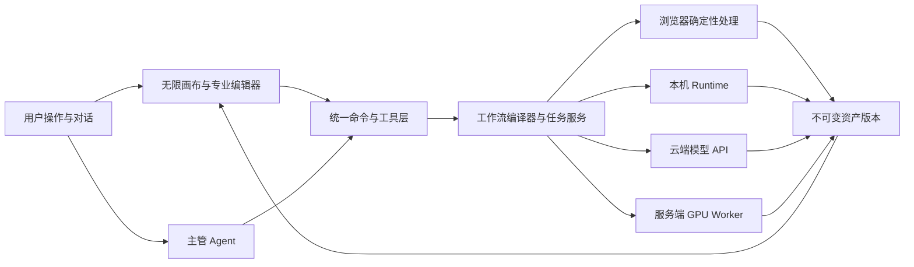

# 光阴砚 AEONQUILL — 项目规划

> **文档梗概**：统一维护光阴砚 AEONQUILL 的目标产品方案、技术演进方向、正式版本、任务原件、责任关系和当前规划状态。
>
> **具体规划法则**：
>
> 1. 本文是未来设计、版本、任务、认领和状态的唯一权威来源。
> 2. 规划目标必须与当前实现分开表述；当前代码事实以[01-开发者文档.md](01-开发者文档.md)为准。
> 3. 小版本、截止日期和责任组由用户或项目负责人手动安排，本文不得自动推断。
> 4. 已完成内容必须由 Git 提交核实并进入[03-开发历史.md](03-开发历史.md)。
>
> **最后一次更新时间**：2026-08-15
>
> **更新者**：项目统筹与产品规划组、开发组、发布工程组、测试与质量保障组

---

## 0. 当前基线与执行规则

- **当前基线**：`V0.3.5` 阶段测试安装包 QA 见证基线；实际候选由干净 V0.3.4 源码 `642e3b9f99c8a3cc4cbd23c3f315532536f7d789` 构建。`REL-003` 已完成 AEONQUILL 主程序、sidecar、当前用户 NSIS、严格 manifest/SHA-256、五目录、旧 runtime 回退及卸载保留；`DEV-013`、`DEV-014` 修复前两轮品牌与生命周期阻断后，`QA-003` 已对唯一第三轮候选给出“通过”。当前仍不具备云端控制面或商业系统。
- **当前规划周期**：`V0.3.x` 阶段软件封包周期于 2026-08-15 启动并在同日经 `QA-003` 独立验收退出；后续正式数字周期尚未由用户或项目负责人建立。
- **当前阶段目标**：`V0.3` 已达成“可交给个人用户试装的 Windows x64 阶段测试安装包”目标，完成 AEONQUILL 品牌安装器、自包含桥接、用户数据隔离、依赖诊断、图像/视频真实能力接线、发布 manifest、SHA-256 和安装—启动—卸载独立验收；签名商业发行、Stage B/D 和云端能力仍在范围外。
- **本轮参与责任组**：主开发、发布工程组、测试与质量保障组；现有产品前端、像素模式与智能视频组保留长期上下文，只有发生其责任域内缺陷时再唤醒。
- **完成迁移规则**：形成稳定实现时同步开发者文档；有实际 Git 提交后写入开发历史；周期结束后再清理规划中的完成任务。

### 0.1 项目对接登记

- **项目对接模式**：启用
- **主控任务标题**：光阴砚 AEONQUILL｜主开发｜总控
- **版本分配者**：主开发；工作组只有在返回 `[READY-FOR-VERSION]` 后才能取得唯一小版本号
- **当前版本轨道**：`V0.3.x`（阶段软件封包已完成；`V0.3.4` 为实际候选源码，`V0.3.5` 为 docs-only QA 见证）
- **集成分支**：`main`
- **提交责任组字段**：启用
- **长期团队策略**：主开发与 QA 固定；本周期启用发布工程组；产品前端、像素模式、智能视频按长期责任域保留；一组一长期任务、一组一隔离工作树
- **项目名称**：光阴砚 AEONQUILL
- **品牌语**：以光为墨，以时为卷。／一念落砚，万象成章。／Shape Light. Weave Time.
- **GitHub**：`falling-feather/AeonQuill` private 仓库
- **验收安排**：`QA-003` 已从唯一候选安装包独立完成安装、启动、数据隔离、图像、视频依赖、生命周期、安全和卸载矩阵并给出“通过”；后续发行周期继续由独立 QA 验收，实现总控不得自证通过

| 小组 | 代号 | 长期任务标题 | 责任边界 | Git 模式 | 分支/工作树 | 生命周期 |
| --- | --- | --- | --- | --- | --- | --- |
| 主开发 | DEV | 光阴砚 AEONQUILL｜主开发｜总控 | 均衡模式、共享契约、版本分配、合并与发布收束 | main | `main` / 根工作区 | 活跃 |
| 产品前端组 | FE | 光阴砚 AEONQUILL｜产品前端组｜长期对接 | 品牌主页面、三模式导航、共享产品壳、恢复与错误体验 | worktree | `codex/team-fe-v02` / `AeonQuill-worktrees/frontend` | 活跃 |
| 像素模式组 | PIXEL | 光阴砚 AEONQUILL｜像素模式组｜长期对接 | 像素文档、导入、工具、图层、帧、预览与 Sprite 链路 | worktree | `codex/team-pixel-v02` / `AeonQuill-worktrees/pixel` | 活跃 |
| 智能视频组 | VIDEO | 光阴砚 AEONQUILL｜智能视频组｜长期对接 | 剧本结构、镜头计划、可执行性与受控视频队列适配 | worktree | `codex/team-video-v02` / `AeonQuill-worktrees/video` | 活跃 |
| 发布工程组 | REL | 光阴砚 AEONQUILL｜发布工程组｜长期对接 | Tauri 主包、sidecar、安装卸载、发布 manifest 与发行物料 | worktree | `codex/team-rel-v03` / `AeonQuill-worktrees/release` | 活跃 |
| QA 组 | QA | 光阴砚 AEONQUILL｜QA组｜长期对接 | `V0.3` 安装到卸载独立验收、回归证据与缺陷退回 | worktree | `codex/team-qa-v02` / `AeonQuill-worktrees/qa-v02` | 活跃 |

具体模块边界、共享契约、工作树写入范围与集成顺序见[22-三模式与项目对接架构.md](02-子文档/22-三模式与项目对接架构.md)；本周期交付边界见[24-V0.3阶段软件封包验收方案.md](02-子文档/24-V0.3阶段软件封包验收方案.md)。

---

## 目录

1. [背景、现状与差距](#1-背景现状与差距)
2. [目标产品架构](#2-目标产品架构)
3. [目标能力与模块状态](#3-目标能力与模块状态)
4. [关键数据与执行模型](#4-关键数据与执行模型)
5. [建议实施顺序](#5-建议实施顺序)
6. [正式任务安排](#6-正式任务安排)
7. [中长期优化路线](#7-中长期优化路线)
8. [责任组与跨组依赖](#8-责任组与跨组依赖)
9. [商业化、许可证与安全边界](#9-商业化许可证与安全边界)
10. [需用户决定的事项](#10-需用户决定的事项)
11. [完成条件与周期清理](#11-完成条件与周期清理)
12. [关联文档](#12-关联文档)

---

## 1. 背景、现状与差距

光阴砚 AEONQUILL 计划成为可商业发布的 Web 端多 Agent 视觉生产工具：在同一项目底座中组合无限画布、图像编辑、像素画绘制、确定性算法、本机工作流和云端生成 API，并由三个模式入口降低不同创作链路的认知负担。

当前原型已经验证“空间画布 + 统一元件 + 基础像素编辑 + 本机视频执行”的交互方向，但距离产品目标仍有以下结构性差距：

| 领域 | 当前能力 | 主要差距 |
| --- | --- | --- |
| 画布 | DOM 元件、相机、手势、属性、历史和本地保存 | 缺少命令注册表、资产引用、性能分层、项目导入和云端同步 |
| 图像编辑 | 图片导入、实验室、浏览器草稿；本机 FFmpeg、u2netp 去背景、Real-ESRGAN 超分、异步任务、下载和派生回填 | 缺少蒙版笔刷、更高质量通用分割/Matting、生成编辑和批量高清导出 |
| 像素编辑 | 可变尺寸单层编辑、调色板、铅笔、橡皮、K-means 量化与 Bayer 抖动 | 缺少图层、帧、算法选型、Sprite 和 Tileset |
| Agent | 关键词正则映射本地操作 | 缺少模型推理、上下文、工具 Schema、计划校验和执行追踪 |
| 工作流 | 正式图片与视频已有持久化 CPU/GPU 调度、幂等/优先级/超时/恢复、SSE、取消、重试、输出版本和本地执行器；浏览器草稿仍为短任务 | 缺少可编辑持久化 DAG、进程级 Worker 隔离和网络/磁盘资源池 |
| 本机服务 | 已有回环 Node 桥接、ComfyUI 生命周期、视频队列与文件资产 | 缺少安装包、应用数据迁移、崩溃恢复、资源配额和安全更新 |
| 云端服务 | 不存在 | 缺少用户、项目、数据库、对象存储、队列、进度和计算调度 |
| 商业系统 | 不存在 | 缺少订阅、积分、成本账本、限流、许可证与内容合规 |

## 2. 目标产品架构

规划中的系统分成创作界面、控制面和计算面：



### 2.1 创作界面

无限画布负责内容摆放、选择、变换、上下文和结果比较；图片、像素画等专业编辑器负责对象内部的精细编辑。画布不能把每个图像像素或处理步骤展开成普通元件。

### 2.2 统一命令与工具层

按钮、快捷键、Agent 和未来工作流节点必须调用同一套经过 Schema 校验的命令。Agent 不得直接修改 React 状态，也不得返回未经校验的整份画布 JSON。

目标工具类别包括：

```text
画布命令：create_element / update_element / layout_elements / group_elements
资产命令：create_asset_version / select_version / export_asset
图像工具：crop / adjust / mask / remove_background / upscale / inpaint
像素工具：quantize / dither / replace_palette / create_sprite_sheet
工作流工具：submit_job / cancel_job / retry_job / accept_result
```

这些名称是规划中的能力分类，不是当前已经存在的接口。

### 2.3 混合计算

| 执行位置 | 适合的规划能力 | 边界 |
| --- | --- | --- |
| 浏览器 | 裁剪、变换、滤镜预览、量化、Dithering、蒙版、像素工具 | 不保存服务端密钥，不承担超大模型 |
| 本机 Runtime | ComfyUI、OpenCV、ONNX/PyTorch、FFmpeg、大图处理 | 需要安装、版本、显卡和安全隔离方案 |
| 服务端 CPU Worker | 文件转换、缩略图、元数据、批量导出 | 与交互 API 分离，避免阻塞请求 |
| 服务端 GPU Worker | 自托管生成、抠图、超分和固定工作流 | 需要队列、容器、显存池、超时和成本追踪 |
| 云端模型 API | 高质量生成、编辑、多角度和视觉理解 | 受价格、速率、地区、数据和许可证条款约束 |

### 2.4 控制面与计算面

业务 API 负责鉴权、项目、任务和计费，不能直接承载长时间 GPU 推理。计算任务进入队列，由对应 Worker 或供应商 Adapter 执行，并通过 SSE 或 WebSocket 推送进度。

ComfyUI 只作为内部执行引擎或本机 Runtime，不应直接暴露公网端口，也不应承担多租户鉴权、计费和业务数据权威来源。

## 3. 目标能力与模块状态

| 模块 | 当前阶段 | 当前实现 | 规划结果 | 主要前置 |
| --- | --- | --- | --- | --- |
| 无限画布 | 原型可用 | 基础相机、元件、派生连接和交互 | 可扩展元件、命令总线、性能分层和资产引用 | 统一命令协议 |
| 图像编辑 | 单机可用 | 七模式实验室、六种本机处理器、持久化 Job、取消/重试/下载、处理栈和派生节点 | 蒙版、独立 Worker 隔离、质量基准与生成式编辑 | 资产版本、处理 Worker |
| 像素工作流 | 原型可用 | 可变尺寸单层编辑、量化与抖动草稿 | 图层、帧、正式算法、Sprite 与导出 | 算法基准、像素数据模型 |
| 资产版本 | 单机可用 | SQLite WAL 元数据、SHA-256 文件、逻辑版本/父版本/provenance、原子保存、安全 GC 和 `.miaohui` 包 | 云端对象存储、多租户配额与远端同步 | 单机模型已完成；云端控制面 |
| 视频工作流 | 单机可用 | 固定 H3 文生/图生模板、持久化 GPU Job、幂等/优先级/超时/恢复、SSE、取消、重试和版本化结果回填 | 通用 DAG、更多受审计工作流 | 模型许可、预设注册表 |
| 通用工作流 DAG | 规划中 | 图片/视频已有统一资源任务契约和输出版本，但没有可编辑 DAG | 节点、边、参数、异步状态和跨执行器编排 | 执行器协议已起步；DAG Schema |
| 多 Agent | 规划中 | 本地关键词模拟 | 主管规划、专业 Agent、工具权限与结果确认 | 命令总线、工作流 |
| 服务端控制面 | 规划中 | 不存在 | 账号、项目、数据库、队列、进度和配额 | 部署区域与技术选型 |
| 计算执行面 | 单机原型可用 | 浏览器处理器 + FFmpeg/rembg/Real-ESRGAN + 按需 ComfyUI H3，GPU 任务串行 | 独立 CPU/GPU Worker和 API 多后端路由 | 模型与节点许可证登记 |
| 商业系统 | 规划中 | 不存在 | 订阅、积分、成本账本、限流和运营指标 | 定价与支付渠道 |

## 4. 关键数据与执行模型

### 4.1 画布文档

目标画布只保存轻量、可协作、可序列化的数据：

```ts
type CanvasNode = {
  id: string
  kind: string
  parentId?: string
  transform: {
    x: number
    y: number
    rotation: number
    scaleX: number
    scaleY: number
  }
  props: Record<string, unknown>
  assetVersionId?: string
  revision: number
}
```

该结构的职责已经通过 `CanvasDocument` schema v1、受控 `CanvasCommand` 和 `CanvasElement.assetVersionId` 落地；这里保留为跨插件目标抽象，实际字段与迁移以开发者文档为准。

### 4.2 资产版本

会改变像素的操作必须生成新版本，不覆盖原文件。当前单机实现已用 SQLite 记录逻辑资产、单调版本、父版本、来源与 SHA-256 内容引用，并把二进制外置到文件系统；保存、导入、GC 与篡改校验已有自动回归。后续仍需补齐缩略图层级、容量配额和云端对象存储，图片二进制不得重新进入画布 JSON 或数据库普通字段。

### 4.3 异步任务

目标任务生命周期：

```text
draft → queued → running → succeeded
                    ├── failed
                    └── cancelled
```

当前单机 Job 已支持幂等键、CPU/GPU 资源、优先级、参数快照、日志、进度、超时、尝试上限、重启恢复、非计费本机资源事件和 SHA-256 输出版本；运行中重启安全失败，排队任务恢复。后续云执行仍需增加网络/磁盘资源池、供应商费用与退款事件，用户接受结果后再由命令层写入正式画布。

### 4.4 Agent 执行

目标执行顺序：

1. 提取选中对象、必要邻域、缩略图和用户目标。
2. 主管 Agent 生成结构化计划。
3. 工作流编译器校验工具权限、参数、版本和预计成本。
4. 在草稿分支执行同步或异步工具。
5. 展示结果、来源和费用，让用户接受、重试或放弃。
6. 接受后提交画布命令，所有动作可追踪和撤销。

## 5. 建议实施顺序

以下是前期设计形成的建议顺序，不是已安排版本，也不是正式任务进度：

| 顺序 | 建议阶段 | 可观察结果 | 不在该阶段承担 |
| --- | --- | --- | --- |
| 0 | 基线治理 | 可恢复 Git 决策、一键验证、回归样本、本地桥接安全和崩溃恢复可用 | 新模型、新 Agent 类型 |
| A | 产品级创作内核 | 命令总线、项目格式、不可变资产、通用 Job、画布基准与桌面壳决策实验可用 | 付费系统、多 Agent、协作 |
| B | 专业创作链路 | 蒙版与修边、图像算法基准、像素图层/帧、Sprite 导出、视频预设与 OOM 降档连贯可用 | Tileset、公开 Custom Node、云端大调度 |
| C | 受控 Agent 编排 | 自然语言生成经 Schema、权限、资源和成本校验的计划，在草稿分支执行 | Agent 直接写数据库、画布或文件系统 |
| D | 商业 Beta 与个人分发 | 签名安装与更新、独立模型包、许可物料清单、设计伙伴测试、权益和成本账本齐备 | 尚未验证需求的无限功能扩张 |
| E | 证据驱动的规模化 | 在用户数据证明需求后再建云同步、多人协作、团队空间与云 GPU | 无触发数据的提前平台化 |

建议首先验证的完整链路是：

```text
上传角色图
→ 裁剪
→ 抠图
→ 转为限定尺寸和色数的像素图
→ 人工修正
→ 生成或组织方向帧
→ 导出 Sprite Sheet
```

用户已要求建立中长期优化方案，因此该链路已作为当前推荐的北极星工作流；首批付费用户、数字版本和日期仍需用户手动确认。完整阶段范围、退出门禁、质量矩阵和决策门见[21-中长期优化路线.md](02-子文档/21-中长期优化路线.md)。

## 6. 正式任务安排

当前任务：

- [x] FE-001｜状态：已完成｜目标版本：精细化交互原型阶段（正式版本号未设置）｜模块：图像工作流原型｜主责：前端与客户端组｜协作：无｜任务：建立图片工具工作台、可替换处理器接口、处理前后预览、任务状态与像素结果流转，并保持画布编辑、本地保存和响应式交互可用；正式去背景和像素采样算法不在本任务内定型｜前置：当前 `0.1.0` 前端原型｜关联文档：[建议实施顺序](#5-建议实施顺序)、[开发者文档模块实现](01-开发者文档.md#6-模块实现)｜关联版本：暂无（Git 仓库当前不可用，未伪造提交）｜验证：`npm run typecheck` 与 `npm run build` 通过；1440×920 和 390×844 实测图片实验室、像素化、去背景草稿、派生节点、任务、32×32 编辑器、撤销重做和响应式布局，控制台无错误
- [x] DEV-001｜状态：已完成｜目标版本：本地视频工作流软件原型阶段（正式数字版本未设置）｜模块：Local Runtime 与视频工作流｜主责：开发组｜协作：前端与客户端组｜任务：重写并版本化一条 MiniMax H3 文生视频 API 工作流，新增一条图生视频 API 工作流，建立只允许固定模板和受控参数的本机 ComfyUI 适配服务，在无限画布中提供文生/图生模式、素材选择、预设参数、连接与显存状态、排队/节点/采样/编码进度、日志、可操作报错、取消和结果回填；同时提供适合后续桌面封装的统一启动入口，不在本任务中实现账号、支付、多租户或云端 GPU 集群｜前置：FE-001、本机 `127.0.0.1:8188` ComfyUI 与 H3 节点可用｜关联文档：[目标产品架构](#2-目标产品架构)、[异步任务](#43-异步任务)、[服务端安全](#93-服务端安全)、[本地 H3 视频工作流](01-子文档/11-本地H3视频工作流.md)｜关联版本：暂无（Git 仓库当前不可用，未伪造提交）｜验证：实时 `/object_info` 契约检查通过；`npm run typecheck`、`npm run build` 通过；RTX 4060 8GB 上文生与图生各完成一条 608×352、124 帧、4 步、原生音频任务并回填可播放 5.167 秒 MP4；Range 返回 206；取消后 Comfy 队列为空；1440×900 与 390×844 浏览器验收通过且控制台无 error/warning
- [x] DEV-002｜状态：已完成｜目标版本：本地视频工作流精细化阶段（正式数字版本未设置）｜模块：Local Runtime 生命周期与视频可控性｜主责：开发组｜协作：前端与客户端组｜任务：实现 ComfyUI 按需启动、队列空闲倒计时关闭和常驻/空闲关闭/手动三种策略；建立面向 RTX 4060 8GB 的分层生成与 720P 交付档位，明确生成分辨率、交付分辨率、最低显存建议和未验证边界；增加结构化导演控制、图生视频可选末帧、任务参数复用、冷启动与显存风险提示，并保持固定工作流白名单和可操作错误闭环｜前置：DEV-001、本机 H3 Turbo v4 节点与 FFmpeg 可用｜关联文档：[目标产品架构](#2-目标产品架构)、[混合计算](#23-混合计算)、[本地 H3 视频工作流](01-子文档/11-本地H3视频工作流.md)｜关联版本：暂无（Git 仓库当前不可用，未伪造提交）｜验证：`npm run typecheck`、`npm run build`、实时 `npm run validate:workflows` 通过；休眠到可用约 38.7 秒，30 秒测试阈值下确认队列为空后自动关闭自有进程并恢复 300 秒配置；FFmpeg 完成 5 秒 MP4 的 1280×720 Lanczos 后处理；浏览器完成导演控制、720P 档、原生高清显存拦截、运行时启停和参数复用，控制台无 error/warning
- [x] DEV-003｜状态：已完成｜目标版本：本地图像处理精细化阶段（正式数字版本未设置）｜模块：图片处理 Worker 与画布工作流｜主责：开发组｜协作：前端与客户端组｜任务：把去背景、超分、像素优化和确定性色彩增强组织为可探测、可排队、可取消、可观察失败的本地图片任务；优先落地本机可实际执行且许可边界清晰的处理器，为缺失模型提供明确的安装状态而非假结果，并将完成资产作为派生图片回填无限画布｜前置：FE-001、DEV-002｜关联文档：[混合计算](#23-混合计算)、[去背景与像素算法候选](#94-去背景与像素算法候选)、[开发者文档模块实现](01-开发者文档.md#6-模块实现)｜关联版本：暂无（Git 仓库当前不可用，未伪造提交）｜验证：`npm run typecheck`、`npm run build`、`npm run validate:image-tools` 与服务端语法检查通过；真实 API 完成 u2netp 去背景、Real-ESRGAN Vulkan 2× 超分、Lanczos、调色板像素化、锐化和透明边清理；取消/非法参数/缺失适配器边界已烟测；浏览器实际提交 1254×1254 去背景与 2508×2508 超分，任务显示进度/执行器/文件大小/下载并自动回填派生节点；390×844 无页面级横向溢出，最终控制台无 error/warning；项目文档校验通过
- [x] PM-001｜状态：已完成｜目标版本：中长期产品优化路线（正式数字版本未设置）｜模块：产品路线、质量门禁与商业化决策｜主责：项目统筹与产品规划组｜协作：开发组、前端与客户端组｜任务：以当前可验证单机原型为基线，建立从基线治理、创作内核、专业创作、受控 Agent、商业 Beta 到证据驱动规模化的阶段路线，定义每阶段范围、排除项、退出门禁、质量指标、风险刹车和决策点｜前置：FE-001、DEV-001、DEV-002、DEV-003｜关联文档：[21-中长期优化路线.md](02-子文档/21-中长期优化路线.md)｜关联版本：暂无（Git 仓库当前不可用，未伪造提交）｜验证：项目文档校验通过，子文档章节、相对链接、阶段依赖和质量门禁可查
- [x] QA-001｜状态：已完成｜目标版本：阶段 0（正式数字版本未设置）｜模块：回归基线与质量门禁｜主责：测试与质量保障组｜协作：开发组、前端与客户端组｜任务：建立一键静态检查、服务契约、图片工具、视频可选环境、浏览器烟测和崩溃恢复的回归入口，并固定匿名样本｜前置：PM-001｜关联文档：[开发者文档第 10.3 节](01-开发者文档.md#103-验证)、[21-中长期优化路线第 4.1 节](02-子文档/21-中长期优化路线.md#41-阶段-0基线治理与可恢复开发)｜关联版本：暂无（Git 仓库当前不可用，未伪造提交）｜验证：初始门禁一次通过语法、文档、13 项单元/离线工作流契约、类型、构建、四种真实 FFmpeg 处理、隔离 API/SSE/PNG/Range 与系统 Edge 桌面/移动烟测，共 23 个分层检查；后续 `SEC-001` 已将其扩展为 18 项单元契约和 24 个分层检查；模拟桥接重启后运行中 Job 变为可操作失败，已完成 Job 与资产不丢失；默认基线不启动 ComfyUI、不改写正式 `.runtime`
- [x] SEC-001｜状态：已完成｜目标版本：阶段 0（正式数字版本未设置）｜模块：本地桥接与运行时安全｜主责：安全组｜协作：开发组、测试与质量保障组、前端与客户端组｜任务：完成随机会话凭据、Origin/Host 白名单、CSP 与浏览器安全响应头、路径引用边界、日志/公共响应脱敏、子进程环境最小化和未知 ComfyUI 节点拦截｜前置：PM-001、QA-001｜关联文档：[开发者文档第 7.1 节](01-开发者文档.md#71-本地-api)、[21-中长期优化路线第 8 节](02-子文档/21-中长期优化路线.md#8-主要风险与刹车机制)｜关联版本：暂无（Git 仓库当前不可用，未伪造提交）｜验证：随机 HttpOnly/SameSite 会话、回环 Host/Origin/Fetch Metadata、CSP/COOP/CORP/Permissions-Policy/nosniff/frame deny、严格资产路径、公共响应递归脱敏、受限子进程环境和节点 ID/type 映射白名单已落地；真实 HTTP 验证无会话 401、恶意 Origin/Fetch Metadata 403、恶意 Host 421、合法预检 204、资产穿越 403；`npm run validate` 通过 24 个分层检查（18/18 单元契约、真实 FFmpeg、隔离 API 和桌面/移动 Edge），`npm audit` 0 项漏洞
- [x] ARCH-001｜状态：已完成｜目标版本：阶段 A（正式数字版本未设置）｜模块：画布文档、命令与能力契约｜主责：系统架构组｜协作：开发组、前端与客户端组、测试与质量保障组｜任务：建立可迁移画布 Schema、统一 Command、ToolDefinition 和草稿提交语义，将用户、快捷工具与后续 Agent 操作收敛到同一校验入口｜前置：QA-001、SEC-001｜关联文档：[开发者文档第 7.2 节](01-开发者文档.md#72-核心数据)、[21-中长期优化路线第 3 节](02-子文档/21-中长期优化路线.md#3-目标技术分层)｜关联版本：暂无（Git 仓库当前不可用，未伪造提交）｜验证：旧 v7 与 version 2 样本迁移为 schema v1；24/24 单元契约通过，其中 6 项覆盖人工/Agent 一致结果、非法/越权参数、锁定节点、媒体注入、过期草稿与连接线级联；Edge 1440×900 验证 8 步拖拽只增加一个 revision 并可撤销/重做，390×844 无横向溢出；`npm run validate` 通过全部 24 个分层检查
- [x] DATA-001｜状态：已完成｜目标版本：阶段 A（正式数字版本未设置）｜模块：本地项目格式与不可变资产｜主责：数据平台组｜协作：开发组、前端与客户端组、测试与质量保障组｜任务：以 SQLite 记录项目、资产版本、哈希、引用和来源，以文件系统保存二进制，实现原子保存、安全回收与可携带项目包导入/导出｜前置：ARCH-001｜关联文档：[开发者文档第 7.2 节](01-开发者文档.md#72-核心数据)、[21-中长期优化路线第 4.2 节](02-子文档/21-中长期优化路线.md#42-阶段-a产品级创作内核)｜关联版本：暂无（Git 仓库当前不可用，未伪造提交）｜验证：100 轮编辑/保存后关闭并重开 SQLite 无节点或资产丢失，过期 writer 与版本冲突被拒绝；8 项项目存储契约覆盖去重、版本父链、失败原子性、目录包/单文件 `.miaohui` 往返、篡改拒绝与引用保护 GC；33/33 总单元契约、隔离项目 API/Range 和 Edge 真实下载/导入均通过，`npm run validate` 完成 25 个分层检查
- [x] BE-001｜状态：已完成｜目标版本：阶段 A（正式数字版本未设置）｜模块：通用任务与资源调度｜主责：后端组｜协作：开发组、数据平台组、测试与质量保障组、前端与客户端组｜任务：将图片和视频 Job 收敛为持久化资源感知调度器，补齐幂等、优先级、超时、崩溃恢复、费用事件和输出版本｜前置：DATA-001｜关联文档：[开发者文档第 5 节](01-开发者文档.md#5-启动与运行流程)、[21-中长期优化路线第 3 节](02-子文档/21-中长期优化路线.md#3-目标技术分层)｜关联版本：暂无（Git 仓库当前不可用，未伪造提交）｜验证：37/37 契约覆盖优先级、CPU/GPU 隔离、排队/运行取消、超时、重启恢复、低磁盘 507 与幂等冲突；隔离 API 对同键重复提交只生成一个 Job，输出 SHA-256 与不可变版本一致；Edge 任务面板展示资源/优先级/尝试/用量/版本并把派生结果保存到项目资产；`npm run validate` 通过 25 个分层检查

- [x] PM-005｜状态：已完成｜目标版本：V0.3｜模块：阶段软件封包目标、任务与验收｜主责：项目统筹与产品规划组｜协作：开发组、发布工程组、测试与质量保障组｜任务：以 `V0.2.8` 为基线锁定 `V0.3.x` Windows x64 阶段软件封包目标，区分本阶段未签名试装包与 `REL-002` 商业发行任务，定义应用本体、外部 ComfyUI/模型、用户数据、发布物料、实施波次和安装到卸载独立验收矩阵｜前置：QA-002、用户要求建立新目标并持续开发直至软件封包完成｜关联文档：[24-V0.3阶段软件封包验收方案.md](02-子文档/24-V0.3阶段软件封包验收方案.md)｜关联版本：V0.3.0｜验证：项目文档与项目对接校验通过；版本轨道、任务、包体边界、排除项、自动证据和人工验收路径均可由权威文档查询
- [x] DEV-012｜状态：已完成｜目标版本：V0.3｜模块：安装运行时、数据目录与依赖诊断｜主责：开发组｜协作：发布工程组｜任务：在安装环境统一 AEONQUILL 运行时身份和兼容配置，建立当前用户数据/配置/缓存/日志目录、ComfyUI 与图像执行器发现/确认/复检、可脱敏诊断快照和页面可操作状态；不得把开发机路径或密钥编译进前端，不得静默下载模型｜前置：PM-005、SEC-001、REL-001｜关联文档：[24-V0.3阶段软件封包验收方案第 3 节](02-子文档/24-V0.3阶段软件封包验收方案.md#3-包体与数据边界)｜关联版本：V0.3.1｜验证：`npm run validate` 42 项、111/111 单元契约、五种确定性图像处理、隔离诊断/配置/客户端状态/API/SSE 和 Edge 1440×900 + 390×844 全通过；真实 D 盘 ComfyUI 有界发现只返回脱敏标签，策略热更新、路径重启提示、旧 runtime 数据兼容回退、焦点循环及跨两个随机 Origin 恢复 2 条创作上下文通过
- [x] REL-003｜状态：已完成｜目标版本：V0.3｜模块：AEONQUILL Windows x64 阶段安装包｜主责：发布工程组｜协作：开发组｜任务：把 Tauri 实验壳收束为 AEONQUILL 主发行壳，对齐产品名称、用户可见身份、版本、图标、sidecar 和安装器，保留内部 identifier 兼容值以维持数据连续性，消除脚本中的旧 `MiaoHui_0.1.0` 硬编码，生成未签名 NSIS、机器可读 release manifest、SHA-256 与许可证/限制说明，并保留 Electron 回退契约验证｜前置：PM-005、REL-001、DEV-012 的稳定契约｜关联文档：[24-V0.3阶段软件封包验收方案第 2 节](02-子文档/24-V0.3阶段软件封包验收方案.md#2-必须闭环的发行链路)、[13-桌面封装与发行架构](01-子文档/13-桌面封装与发行架构.md)｜关联版本：V0.3.2｜验证：产品包版本 `0.3.0` 从单一版本源生成主程序、自包含 Node 22 sidecar、当前用户 NSIS 与严格 manifest；系统 Node 不在 PATH 时 sidecar 生命周期通过；隔离安装版完成真实启动、五目录、旧 runtime 持久数据回退、用户数据保留、卸载及注册项/快捷方式清理；受控 staging 的字节数、SHA-256、Windows x64、Authenticode、源码 SHA 和脏状态可机器核对，Electron packaged 回退壳同核生命周期通过
- [x] DEV-013｜状态：已完成｜目标版本：V0.3｜模块：阶段候选品牌一致性修复｜主责：开发组｜协作：测试与质量保障组、发布工程组｜任务：修复 `QA-003` 在 V0.3.2 安装前审计发现的新 H3 输出仍使用 `MiaoHui/` 的发布阻断；把新 H3 输出、上传临时文件、Comfy client ID、公开错误/诊断、开发门禁和 rembg runner 改为 AEONQUILL，并让桌面壳优先转发 `AEONQUILL_*` 图片工具变量；旧项目扩展名、Header、Cookie、服务 ID、存储键和 userData 只作为兼容接口保留｜前置：REL-003、QA-003 首轮退回｜关联文档：[03-开发历史 V0.3.3](03-开发历史.md#320-v033-dev-fixbrand-清理新产物与公开诊断中的旧品牌dev-013)、[24-V0.3阶段软件封包验收方案第 5.3 节](02-子文档/24-V0.3阶段软件封包验收方案.md#53-波次三发布产物)｜关联版本：V0.3.3｜验证：所有固定 H3 模式/档位/时长/画幅均生成 `AEONQUILL/` 安全前缀；两份模板、图片工具诊断、项目包错误、回环错误和验证输出无新增旧品牌；Tauri/Electron 同时支持 AEONQUILL 优先与 MIAOHUI 兼容变量；`npm run validate` 44 项、118/118 单元契约、五种真实图片处理、隔离 API/SSE、Edge 桌面/移动和 Tauri 编译检查通过，重建候选仍须从本提交干净生成
- [x] DEV-014｜状态：已完成｜目标版本：V0.3｜模块：Tauri 主窗口退出生命周期修复｜主责：开发组｜协作：测试与质量保障组、发布工程组｜任务：修复 `QA-003` 在 V0.3.3 重建候选中发现的真实主窗口关闭后无界面后台驻留；让 `main` 窗口 `CloseRequested` 显式退出应用事件循环，随后复用既有标准输入协议优雅关闭 sidecar 与端口，并把桌面 QA 从合成 `app.exit()` 改为真实 `window.close()`｜前置：DEV-013、QA-003 第二轮退回｜关联文档：[03-开发历史 V0.3.4](03-开发历史.md#321-v034-dev-fixlifecycle-关闭主窗口时退出桌面进程树dev-014)、[13-桌面封装与发行架构第 4 节](01-子文档/13-桌面封装与发行架构.md#4-tauri-主发行壳)｜关联版本：V0.3.4｜验证：发行契约锁定真实窗口关闭语义；Tauri debug 实测 `windowCloseRequestedMs=3707`、`shutdownFinishedMs=4015`，sidecar 退出码 0、未强杀、随机端口关闭；`npm run validate` 44 项、118/118 单元契约、五种真实图片处理、隔离 API/SSE 与 Edge 桌面/移动通过，干净安装包门禁在提交后执行
- [x] QA-003｜状态：已完成｜目标版本：V0.3｜模块：阶段软件包独立验收｜主责：测试与质量保障组｜协作：开发组、发布工程组｜任务：在实现进入候选基线后，独立执行安装、首次启动、数据隔离、依赖诊断、确定性图像处理、H3 可用/阻塞、空闲关闭、真实主窗口退出、桥接重启、项目保留、安全、快捷方式/卸载登记和卸载清理矩阵，并按通过或退回给出证据｜前置：DEV-012、REL-003、DEV-013、DEV-014 与主开发集成完成｜关联文档：[24-V0.3阶段软件封包验收方案第 4 节](02-子文档/24-V0.3阶段软件封包验收方案.md#4-完成定义与验收矩阵)、[03-开发历史 V0.3.5](03-开发历史.md#322-v035-qa-testpackage-完成-aeonquill-阶段安装包独立验收qa-003)｜关联版本：V0.3.5｜验证：唯一候选源为 `642e3b9f99c8a3cc4cbd23c3f315532536f7d789`、29,055,739 bytes、SHA-256 `8e290ec39c7982c4107945b306460299045c9eee0d7b5ccfa960b5c4da35352d`，manifest dirty=false、6/6、Authenticode `NotSigned`；system-only PATH 安装首启、五目录与旧数据回退、安装版真实 FFmpeg 派生/下载/重载、像素与智能视频跨随机端口恢复、SSE 强杀重启追平、取消/重试、Cookie/Origin/脱敏、1440×900/390×844、真实 `WM_CLOSE` 下 desktop/自有 sidecar/端口 7.937 秒内无强杀退出、卸载及用户数据保留全部通过；`npm run validate` 44 项、118/118 单元契约、五种真实 FFmpeg、文档/交接/release manifest/diff 门禁通过。未重复 H3、缺失可选模型保持阻塞、未签名/无更新回滚、许可证/SBOM/商业再分发、非捆绑 Comfy/Python/nodes/models/API key、`AI-001` 样本门和 518.75 kB 分块警告作为非阻断限制保留

候选任务：

- [x] PERF-001｜状态：已完成｜目标版本：阶段 A（正式数字版本未设置）｜模块：无限画布性能与渲染决策｜主责：性能组｜协作：前端与客户端组、后端组、测试与质量保障组｜任务：建立固定画布基准，实施视口裁剪、缩略图分级、空间索引与热区优化，只在 DOM 方案实测超标时形成 PixiJS/WebGL 子场景迁移决策｜前置：QA-001、ARCH-001｜关联文档：[12-无限画布性能与资源分级](01-子文档/12-无限画布性能与资源分级.md)、[21-中长期优化路线第 6 节](02-子文档/21-中长期优化路线.md#6-质量指标与基准矩阵)｜关联版本：暂无（Git 仓库当前不可用，未伪造提交）｜验证：固定 300 轻节点 + 30 个复用真实 3840×2160 内容资产的图片节点在系统 Edge 通过桌面/窄屏断言；帧 P95 均 4.3ms，指针反馈 P95 为 4.8/4.4ms，平移后挂载 46/27 个画布节点，总 DOM 348/279，受管原图解码为 0；43/43 单元契约、类型、生产构建与真实 FFmpeg 预览 API 通过，`npm run validate` 完成 27 个分层检查；结论为保留 DOM 主画布，只在高密度图片/像素/动画触发门槛时增加 PixiJS/WebGL 子场景
- [x] REL-001｜状态：已完成｜目标版本：阶段 A（正式数字版本未设置）｜模块：桌面壳决策实验｜主责：发布工程组｜协作：开发组、前端与客户端组、测试与质量保障组｜任务：以同一桥接、沙箱与生命周期契约实现 Electron/Tauri 实验壳，量化启动、进程树资源、包体与安装卸载，形成可逆选型；签名、真实更新/回滚和模型分包严格留给 `REL-002`，不在阶段 A 冒充发布渠道｜前置：SEC-001、BE-001｜关联文档：[13-桌面封装与发行架构](01-子文档/13-桌面封装与发行架构.md)、[21-中长期优化路线第 5.6 节](02-子文档/21-中长期优化路线.md#56-桌面封装模型包与更新)｜关联版本：暂无（Git 仓库当前不可用，未伪造提交）｜验证：Electron packaged 20 项、Tauri release 22 项生命周期/沙箱断言通过；自包含 Node 22 sidecar 在无系统 Node 的 PATH 下启动并正常关闭；27.4 MiB 未签名 NSIS 完成隔离安装、真实应用启动、卸载及注册项/快捷方式清理；三轮交替基准记录 Electron/Tauri 加载中位数 0.857/1.446 秒、私有内存 434.4/466.3 MiB、运行文件 348.8/96.2 MiB，暂定 Tauri 为个人分发候选、Electron 为回退壳；46/46 单元契约与 34 项完整基线通过
- [x] DEV-005｜状态：已完成｜目标版本：V0.1｜模块：Git、GitHub 与初始工程基线｜主责：开发组｜协作：无｜任务：把用户确认的现有原型作为首次可追踪快照初始化到 `main`，排除本机运行时、模型、构建产物、机器配置和协作工具私有目录；在当前认证的 `falling-feather` 账号创建 private 仓库 `AeonQuill`、绑定 `origin` 并推送初始提交，不把此前无法恢复的开发过程伪造成独立历史｜前置：用户确认初始化新 Git 与 GitHub 仓库｜关联文档：[03-开发历史.md 第 3 节](03-开发历史.md#3-独立提交记录)｜关联版本：V0.1.0｜验证：`git status --short` 为空、`git remote -v` 指向 `falling-feather/AeonQuill`、GitHub 默认分支可读取，模型与 `.runtime` 不在索引中
- [x] PM-003｜状态：已完成｜目标版本：V0.1｜模块：品牌、三模式架构与项目对接｜主责：项目统筹与产品规划组｜协作：开发组｜任务：锁定“光阴砚 AEONQUILL”品牌与品牌语，登记均衡模式、像素模式、智能视频的职责边界，启用 `V0.1.x` 小版本分配规则、责任组字段、三条长期工作树和主线集成规则；按用户要求本轮不创建独立 QA 长期任务｜前置：DEV-005、用户确认三模式与协作安排｜关联文档：[22-三模式与项目对接架构.md](02-子文档/22-三模式与项目对接架构.md)、[项目对接登记](#01-项目对接登记)｜关联版本：V0.1.1｜验证：项目文档校验通过，品牌、任务、组别、分支、工作树、版本分配者与延后验收边界均可由本文查询
- [x] DEV-006｜状态：已完成｜目标版本：V0.1｜模块：均衡模式 ComfyUI 语义图像工作流｜主责：开发组｜协作：无｜任务：为元素提取、区域编辑、定点修改和人像调整建立版本化工作流注册表、节点/参数白名单、能力探测、资源档位与统一输出契约；缺少模型或节点时必须显示真实不可用原因，不得提交任意 ComfyUI 图或伪造结果｜前置：PM-003、ARCH-001、BE-001｜关联文档：[22-三模式与项目对接架构第 5 节](02-子文档/22-三模式与项目对接架构.md#5-comfyui-语义图像工作流)、[图像算法基准与蒙版工作流第 2.4 节](01-子文档/14-图像算法基准与蒙版工作流.md#24-sam-点击元素提取)｜关联版本：V0.1.2｜验证：四类稳定工作流注册表与 6 项离线契约覆盖 ready/休眠/缺依赖/节点不匹配/模板待实现及严格点参数；`npm run test:unit` 61/61、类型和构建通过；本机 1254×1254 样例经隔离桥接真实完成 ComfyUI 按需启动、Impact SAM 点击分割、透明元素/灰度蒙版双输出、不可变版本、用量记录和安全关闭，API/公开 Job 不泄露本机路径；区域编辑、定点修改和人像调整只登记真实依赖与 `template-pending`，尚未伪开放执行
- [x] FE-003｜状态：已完成｜目标版本：V0.1｜模块：产品主页面与三模式产品壳｜主责：前端与客户端组｜协作：开发组｜任务：建立 AEONQUILL 品牌主页面、三个模式入口、最近项目与本地运行时概览，以及可由主线接线的类型化模式注册契约；首轮在隔离目录实现，不抢改主入口和共享状态｜前置：PM-003｜关联文档：[22-三模式与项目对接架构第 3 节](02-子文档/22-三模式与项目对接架构.md#3-产品主页面与共享外壳)｜关联版本：V0.1.5｜验证：类型检查与构建通过；隔离桌面/390×844 浏览器检查确认键盘模式切换、`aria-current`、无横向溢出和控制台零 warning/error；由 `DEV-007` 完成主线接线
- [x] PIXEL-001｜状态：已完成｜目标版本：V0.1｜模块：像素模式第一纵切｜主责：像素模式组｜协作：开发组｜任务：在隔离模块中建立像素文档、图层、帧、调色板、洋葱皮和 Sprite 元数据的确定性命令内核，并提供可由主线挂载的像素工作台首轮界面｜前置：PM-003、ARCH-001、DATA-001｜关联文档：[22-三模式与项目对接架构第 2 节](02-子文档/22-三模式与项目对接架构.md#2-三模式职责矩阵)｜关联版本：V0.1.4｜验证：7 项像素专项契约覆盖严格校验、逆命令、迁移、合成和 Sprite 布局；一次 pointer gesture 批量提交为一次 revision/撤销单元；类型和构建通过，`DEV-007` 已接入会话草稿与 PNG/元数据下载
- [x] VIDEO-001｜状态：已完成｜目标版本：V0.1｜模块：智能视频第一纵切｜主责：智能视频组｜协作：开发组｜任务：建立严格的故事项目 Schema、从灵感/剧本到场景与镜头的确定性编译骨架、角色/场景/关键帧任务计划和可由主线挂载的智能视频工作台；首轮不直接调用外部文本 API，不允许任意 ComfyUI 工作流｜前置：PM-003、ARCH-001、BE-001｜关联文档：[22-三模式与项目对接架构第 2 节](02-子文档/22-三模式与项目对接架构.md#2-三模式职责矩阵)｜关联版本：V0.1.3｜验证：6 项专项契约覆盖确定性 ID、场景/镜头、受控 workflow、严格 LLM 候选和非法计划拒绝；类型和构建通过；集成样例稳定生成 2 场景、4 镜头、16 个受控任务且执行按钮保持禁用
- [x] DEV-007｜状态：已完成｜目标版本：V0.1｜模块：三模式主线集成与品牌表层｜主责：开发组｜协作：前端与客户端组、像素模式组、智能视频组｜任务：审查三个纵切，按唯一版本合并；建立 `ProductApp` Hash 导航、真实运行时/模式可用性映射、返回路径、像素草稿与 Sprite 下载宿主，并把网页可见品牌统一为“光阴砚 AEONQUILL”，保留 `.miaohui` 等迁移兼容接口｜前置：FE-003、PIXEL-001、VIDEO-001、DEV-006｜关联文档：[22-三模式与项目对接架构第 8 节](02-子文档/22-三模式与项目对接架构.md#8-集成顺序与阶段门禁)｜关联版本：V0.1.6｜验证：`npm run test:unit` 74/74、类型检查、生产构建与 `git diff --check` 通过；桌面和 390×844 浏览器开发自检覆盖主页、三模式导航/返回、像素绘制/撤销、智能视频编译及控制台零 warning/error；按用户要求仍待独立 QA
- [x] PM-004｜状态：已完成｜目标版本：V0.2｜模块：原型完善目标、任务与验收｜主责：项目统筹与产品规划组｜协作：开发组、前端与客户端组、像素模式组、智能视频组、测试与质量保障组｜任务：以 `V0.1.6` 为基线锁定 `V0.2.x` 中期目标、范围外内容、四条纵向链路、实施波次、长期工作组续接方式和独立验收矩阵，使“原型完善”具备可执行、可判断的统一口径｜前置：DEV-007、用户要求制定并执行中期目标｜关联文档：[23-V0.2原型完善验收方案.md](02-子文档/23-V0.2原型完善验收方案.md)｜关联版本：V0.2.0｜验证：项目文档与项目对接校验通过；版本轨道、任务、依赖、排除项、自动证据和人工验收路径均可由权威文档查询
- [x] FE-004｜状态：已完成｜目标版本：V0.2｜模块：统一产品壳、项目恢复与界面状态｜主责：前端与客户端组｜协作：开发组｜任务：在真实三模式入口上补齐可复用的加载、空、失败、重试与草稿恢复反馈；让最近项目和模式返回保持正确模式/项目上下文，深链刷新可恢复，键盘与窄屏路径不依赖开发工具｜前置：PM-004、DEV-007｜关联文档：[23-V0.2原型完善验收方案第 2.1 节](02-子文档/23-V0.2原型完善验收方案.md#21-统一产品壳与恢复链)｜关联版本：V0.2.2｜验证：5 项产品壳纯逻辑契约与 79/79 全量单元契约通过，`npm run validate:quick` 35 项、类型检查、生产构建、文档与交接校验通过；隔离 ProjectStore 与浏览器草稿真实完成 1440×900、390×844 的主页—三模式—返回—重开/刷新，加载/空/失败/重试/恢复状态可辨识，未知 Hash 安全回主页，无页面级横向溢出和控制台 error/warning；主线集成后仍需独立 QA
- [x] PIXEL-002｜状态：已完成｜目标版本：V0.2｜模块：像素导入、动画预览与项目往返｜主责：像素模式组｜协作：开发组｜任务：在严格 `PixelDocument` 上实现 PNG/WebP 导入到可控尺寸/调色板/抖动的确定性转换、帧播放预览、像素项目 JSON 导入导出以及 PNG/Sprite Sheet/metadata 成套导出；重新导入后保持文档语义等价｜前置：PM-004、PIXEL-001｜关联文档：[23-V0.2原型完善验收方案第 2.3 节](02-子文档/23-V0.2原型完善验收方案.md#23-像素资产生产链)、[03-开发历史 V0.2.4](03-开发历史.md#312-v024-pixel-featpixel-打通像素图像转换动画预览与项目成套往返pixel-002)｜关联版本：V0.2.4｜验证：固定 4×4 RGBA 转换哈希 `ad2c3bdfef7a8160f2731eaa15bd4f6656663c0d6cec8748bcc0fd4942437d8c`，透明阈值 0、极端宽高比、三种抖动、非法输入、显式 schema v0 迁移、v1 语义往返与 Sprite 同布局契约通过；Edge 实测 1254×1254 PNG 转 48×48/12 色/Bayer4，加图层、复制帧和单笔 6 像素修正后 revision 只按命令增加，动画跨帧播放不改变 revision；项目重开、四件套导出反馈、390×844 无横向溢出和 console 零 warning/error 均已记录；主线集成后仍需独立 QA
- [x] DEV-009｜状态：已完成｜目标版本：V0.2｜模块：像素内存草稿配额恢复｜主责：开发组｜协作：前端与客户端组、像素模式组｜任务：修复合法大项目写入 `localStorage` 失败后旧项目 Hash 抢先触发错误 Gate、导致当前内存文档无法继续导出的集成缺陷；持久化失败时同步内存文档 ID，只有无可用文档或真实 ID 不匹配时进入错误页｜前置：PIXEL-002、FE-004、V0.2.4 主线集成实测｜关联文档：[03-开发历史 V0.2.5](03-开发历史.md#313-v025-dev-fixpixel-recovery-保留存储配额失败时的内存像素草稿dev-009)｜关联版本：V0.2.5｜验证：新增纯路由契约覆盖匹配内存文档、错误无文档和 ID 不匹配；真实导入 26.7 MB、512×512、6 帧项目触发配额失败后仍停留工作台，Hash 更新为 `qa-large-memory-draft`、全部 6 帧可见并明确提示刷新前导出，控制台无 warning/error
- [x] DEV-010｜状态：已完成｜目标版本：V0.2｜模块：产品壳浏览器回归入口｜主责：开发组｜协作：测试与质量保障组、前端与客户端组｜任务：修复产品壳上线后默认浏览器烟测仍假定启动页直接显示旧版画布的过期契约；从主页稳定选择均衡模式，并在隔离 ProjectStore 为空时显式确认创建本机画布后再执行原画布回归｜前置：FE-004、QA-002 候选基线检查｜关联文档：[03-开发历史 V0.2.6](03-开发历史.md#314-v026-dev-testbrowser-更新产品壳后的均衡模式冒烟入口dev-010)｜关联版本：V0.2.6｜验证：`npm run validate:browser` 在系统 Edge 完成 1440×900 与 390×844 全链烟测，控制台、HTTP 和页面异常列表为空
- [x] DEV-011｜状态：已完成｜目标版本：V0.2｜模块：桥接重启与任务流恢复｜主责：开发组｜协作：测试与质量保障组、前端与客户端组、智能视频组｜任务：修复桥接强制重启并轮换本机会话后原生 EventSource 可能停留在终止状态、短任务虽已完成但页面保持假性 0% 的恢复缺陷；统一续签会话、退避重建 SSE，并用服务端 Job 快照追平断线窗口｜前置：DEV-010、QA-002 恢复矩阵｜关联文档：[03-开发历史 V0.2.7](03-开发历史.md#315-v027-dev-fixrecovery-桥接重启后续签并追平任务流dev-011)｜关联版本：V0.2.7｜验证：自动 Edge 烟测在同一页面强杀并重启隔离桥接、轮换会话、提交第二个确定性 Job，无刷新取得 completed 状态、优先级与派生资产；`npm run validate` 40 项、99/99 单元契约、文档和项目交接校验均通过，独立结论仍由 QA-002 单独登记
- [x] VIDEO-002｜状态：已完成｜目标版本：V0.2｜模块：智能视频计划可执行性与本机队列适配｜主责：智能视频组｜协作：开发组｜任务：为故事计划增加 ready/blocked 依赖判定、用户确认的执行清单和严格执行清单 Schema；把允许的单镜头/镜头集合编译成现有 MiniMax H3 文生/图生提交参数并接入既有 Job/SSE 状态，缺少首帧、末帧、模型或显存时显示真实阻塞，不开放任意工作流｜前置：PM-004、VIDEO-001、DEV-002｜关联文档：[23-V0.2原型完善验收方案第 2.4 节](02-子文档/23-V0.2原型完善验收方案.md#24-智能视频计划执行链)｜关联版本：V0.2.3｜验证：严格选择/清单/确认/受管资产契约和固定 T2V/I2V 映射已实现；专项测试覆盖稳定 ID、ready/blocked、首末帧、模型/桥接/显存、未知字段/工作流、确认篡改、载荷元数据调包及 asset ID 不变时的实际字节替换；类型、构建通过；开发浏览器在桥接离线与 I2V 缺首帧场景显示真实阻塞且提交禁用，现有 Job/SSE/取消/重试接线待主线真实运行时与独立 QA 复核
- [x] DEV-008｜状态：已完成｜目标版本：V0.2｜模块：均衡模式语义蒙版与受控局部编辑｜主责：开发组｜协作：前端与客户端组｜任务：复用 `DEV-006` 的 SAM 选区、现有图片 Job 和不可变资产，建立蒙版边缘参数、至少一种完全离线确定性局部操作以及受控生成式工作流能力探测；完成结果创建派生资产、画布节点和来源记录，不覆盖原图｜前置：PM-004、DEV-006、DEV-003｜关联文档：[23-V0.2原型完善验收方案第 2.2 节](02-子文档/23-V0.2原型完善验收方案.md#22-均衡模式语义局部编辑链)、[图像算法基准与蒙版工作流](01-子文档/14-图像算法基准与蒙版工作流.md)｜关联版本：V0.2.1｜验证：75/75 单元契约、类型、构建、七项图片处理器和隔离 Mask API 通过；真实浏览器完成 SAM 冷启动提取、Alpha 蒙版背景压暗、派生资产/节点/来源回填、桌面与 390×844 重载恢复且无控制台 warning/error；原图输入门禁与生成式模板待就绪状态可辨识
- [x] QA-002｜状态：已完成｜目标版本：V0.2｜模块：原型完善独立验收｜主责：测试与质量保障组｜协作：开发组、前端与客户端组、像素模式组、智能视频组｜任务：在实现波次进入候选集成基线后，独立执行四条纵向链路、桌面/窄屏、刷新/桥接恢复、取消/失败/重试、安全与控制台检查；按通过/有条件通过/退回给出证据，并把范围内缺陷退回原组｜前置：FE-004、PIXEL-002、VIDEO-002、DEV-008 与主开发集成完成｜关联文档：[23-V0.2原型完善验收方案第 3 节](02-子文档/23-V0.2原型完善验收方案.md#3-完成定义与验收矩阵)｜关联版本：V0.2.8｜验证：在基线 `b71a7534bcfa92f28ee8024d2c7471015076d0e9`、Windows/Node.js 22.20.0/系统 Edge/RTX 4060 8GB 上给出“通过”；`validate:quick` 36 项、完整 `validate` 40 项、99/99 单元契约、生产构建、文档/项目对接校验与差异检查通过；1440×900、390×844 独立覆盖统一壳、四条纵向链、桥接强制重启续签/SSE 快照追平、四文件真实下载、像素大项目配额降级、回环会话/Origin 与公开响应脱敏。`V0.2.6` 发现的恢复 P1 已由 `DEV-011` 修复并在 `V0.2.7` 同条件复测通过；未重复 H3 生成、缺失模型依赖未实跑、`AI-001` 正式样本门未达三项均作为非阻断限制保留，不扩大为商业或 Stage B 完成结论
- [ ] FE-002｜状态：暂缓｜目标版本：阶段 B（正式数字版本未设置）｜模块：像素画图层、帧与 Sprite 导出｜主责：前端与客户端组｜协作：开发组｜任务：原任务范围已合并到更完整、具备独立责任组与工作树的 `PIXEL-001`，保留本条仅用于历史追踪｜前置：ARCH-001、DATA-001｜暂缓原因：用户将像素模式升级为独立长期模块，继续以原前端子任务并行会造成范围重复｜暂缓开始：2026-08-14｜下次复查：2026-08-28；若 `PIXEL-001` 已覆盖全部原验证则关闭本任务，否则拆回未覆盖部分｜关联文档：[21-中长期优化路线第 5.3 节](02-子文档/21-中长期优化路线.md#53-像素画与游戏资产)、[22-三模式与项目对接架构](02-子文档/22-三模式与项目对接架构.md)｜关联版本：暂无｜验证：不单独实施；以 `PIXEL-001` 的固定多层多帧项目与 Sprite 元数据验证为准
- [ ] AI-001｜状态：未认领｜目标版本：阶段 B（正式数字版本未设置）｜模块：图像算法基准、蒙版与返修质量｜主责：算法与模型组（待启用）｜协作：开发组、前端与客户端组｜任务：建立去背景、超分与像素化固定样本和报告，增加蒙版笔刷与边缘修复，以边界质量、时延、VRAM 与人工返修时间定型本地算法组合｜前置：QA-001、BE-001｜关联文档：[21-中长期优化路线第 5.2 节](02-子文档/21-中长期优化路线.md#52-图像处理与蒙版)｜关联版本：暂无｜验证：四类样本每类至少 20 张完成自动与人工评估，候选定型报告含 P50/P95、VRAM、边界质量、返修时间和许可状态
- [ ] DEV-004｜状态：未认领｜目标版本：阶段 B（正式数字版本未设置）｜模块：视频预设注册表与显存降档｜主责：开发组｜协作：前端与客户端组｜任务：将 H3 与后续视频流组织为可版本预设注册表，增加 VRAM 前检、OOM 可操作降档、中间结果保留、统一 720P 交付与 4060 回归套件｜前置：BE-001｜关联文档：[21-中长期优化路线第 5.4 节](02-子文档/21-中长期优化路线.md#54-视频与-comfyui-运行时)｜关联版本：暂无｜验证：RTX 4060 8GB 安全档 10 次文生和 10 次图生回归完成率不低于 90%，风险配置在提交前拦截或提供降档，交付可解码可 seek
- [ ] AI-002｜状态：未认领｜目标版本：阶段 C（正式数字版本未设置）｜模块：受控 Agent 计划、草稿执行与 provenance｜主责：算法与模型组（待启用）｜协作：系统架构组（待启用）、开发组｜任务：实现主管 Agent 计划、Schema/权限/资源/成本编译、草稿分支执行、用户审批、重放与来源追踪，不给模型数据库或文件系统凭据｜前置：ARCH-001、DATA-001、BE-001｜关联文档：[21-中长期优化路线第 4.4 节](02-子文档/21-中长期优化路线.md#44-阶段-c受控-agent-与工作流编排)｜关联版本：暂无｜验证：100 个固定异常场景中计划 Schema 合格率不低于 95%，越权执行和未经确认的正式画布写入均为 0，手工工具在 Agent 不可用时继续工作
- [ ] REL-002｜状态：未认领｜目标版本：阶段 D（正式数字版本未设置）｜模块：签名分发、更新与模型包｜主责：发布工程组（待启用）｜协作：开发组、安全组｜任务：基于 REL-001 定型结果实现签名安装包、分阶段更新和回滚，将应用、运行时与模型分包，建立断点续传、哈希、来源、许可与卸载清理｜前置：REL-001、SEC-001｜关联文档：[21-中长期优化路线第 4.5 节](02-子文档/21-中长期优化路线.md#45-阶段-d商业-beta-与个人分发)｜关联版本：暂无｜验证：干净 Windows 环境安装/升级/回滚/卸载通过，更新不覆盖项目与模型，损坏模型包不进入可用状态，发布物料清单完整率 100%
- [ ] PM-002｜状态：未认领｜目标版本：阶段 D（正式数字版本未设置）｜模块：设计伙伴、定价证据与发布决策｜主责：项目统筹与产品规划组｜协作：开发组、前端与客户端组、像素模式组、智能视频组｜任务：选择一类主要用户与 5–10 名设计伙伴，记录北极星完成率、首个可用资产时间、返修、留存、单次有效交付成本和付费意愿，据此形成是否进入正式商业发布的决策｜前置：PIXEL-001、AI-001、DEV-004、REL-002｜关联文档：[21-中长期优化路线第 7 节](02-子文档/21-中长期优化路线.md#7-商业化与发布策略)｜关联版本：暂无｜验证：伙伴原始记录、成本账本、改进优先级和 go/no-go 评审结论完整可追溯

后续任务必须采用以下字段：

```md
- [ ] 责任代码-三位流水｜状态：已认领｜目标版本：用户手动安排｜模块：明确模块｜主责：已登记责任组｜协作：已登记协作组或无｜任务：可观察的具体结果｜前置：任务编号或无｜关联文档：本文具体章节｜关联版本：暂无｜验证：可执行的命令或页面结果
```

本段格式示例不代表当前任务或进度。

## 7. 中长期优化路线

用户已要求建立面向当前产品的中长期优化方案，并在 `V0.2.8` 原型通过后继续推进到阶段软件封包；`V0.3.x` 已在 `V0.3.5` 完成独立验收并退出。长期阶段路线见[21-中长期优化路线.md](02-子文档/21-中长期优化路线.md)；本周期完成口径见[24-V0.3阶段软件封包验收方案.md](02-子文档/24-V0.3阶段软件封包验收方案.md)。

| 阶段 | 建议投入窗口 | 核心产出 | 解锁条件 |
| --- | --- | --- | --- |
| 0 基线治理 | 2–3 周 | 可恢复版本管理决策、一键验证、回归样本、本地安全与崩溃恢复 | 已完成资产不丢失，任务恢复可操作，回归不再完全依赖手工 |
| A 创作内核 | 4–6 周 | 命令、Schema 迁移、SQLite/文件资产、通用 Job、性能基准、桌面壳决策实验 | 项目可导入/导出，任务和资产可追溯，渲染与封装方向有数据决策 |
| B 专业创作 | 6–10 周 | 蒙版、算法基准、像素图层/帧、Sprite 导出、视频预设和显存降档 | 5 名目标用户中至少 4 名无指导完成纵向链路，4060 安全档回归达标 |
| C 受控 Agent | 8–12 周 | 工具 Schema、计划编译、草稿执行、用户审批、成本与 provenance | 越权和未审批正式写入为 0，Agent 故障不影响手工工作流 |
| D 商业 Beta | 8–12 周 | 签名分发、独立模型包、更新回滚、许可清单、设计伙伴和成本账本 | 干净 Windows 全流程通过，发布物料可审计，用户和付费证据支持继续 |
| E 规模化 | 不预设 | 云同步、Yjs/CRDT 协作、团队空间、云 GPU 与组织控制 | 只在单人留存、付费和团队协作需求已被真实数据验证后启动 |

### 7.1 版本口径

| 层级 | 当前记录 |
| --- | --- |
| 包清单版本 | `0.3.0`，是已验收阶段安装包的产品 SemVer；与候选源码小版本 `V0.3.4` 和 QA 见证版本 `V0.3.5` 分开记录，不等于正式公开发行资格 |
| 当前大/中版本轨道 | `V0.3.x` 阶段软件封包周期已在 `V0.3.5` 经独立验收退出；`V0.2.x` 已在 `V0.2.8` 退出；`V0.1.x` 已作为首轮纵切基线结束扩展；下一正式数字轨道尚未建立 |
| 已使用小版本 | `V0.1.0`—`V0.1.6` 首轮可追踪基线与三模式纵切；`V0.2.0`—`V0.2.8` 原型完善与独立验收；`V0.3.0` 阶段封包方案；`V0.3.1` 安装态运行时与恢复；`V0.3.2` AEONQUILL Windows x64 阶段安装包工程；`V0.3.3` 新产物与公开诊断品牌修复；`V0.3.4` 主窗口退出生命周期修复及实际候选源码；`V0.3.5` QA 独立验收见证与周期收口 |
| 后续小版本 | `V0.3.0`—`V0.3.5` 已依次分配给 `PM-005`、`DEV-012`、`REL-003`、`DEV-013`、`DEV-014`、`QA-003`；后续版本须在新周期由主开发明确分配，工作组不得预占、复用或自行推断 |
| 开始与截止日期 | `V0.3` 于 2026-08-15 开始，并在同日由 `QA-003` 对真实候选安装包给出“通过”后退出 |

本周期的版本轨道、责任组和首批任务由用户“设立新目标并持续开发直至软件封包完成”的要求启动；没有进入本轮登记的候选任务仍不得自动改为已认领。

## 8. 责任组与跨组依赖

### 8.1 当前启用的责任组

| 代码 | 责任组 | 职责范围 | 启用日期 |
| --- | --- | --- | --- |
| `FE` | 前端与客户端组 | 浏览器画布、图片工作台、像素编辑、前端状态和响应式交互 | 2026-07-28 |
| `DEV` | 开发组 | 跨前端、本机服务与工作流模板的集成功能 | 2026-08-12 |
| `PM` | 项目统筹与产品规划组 | 产品路线、阶段门禁、任务编排、用户验证和商业决策记录 | 2026-08-13 |
| `QA` | 测试与质量保障组 | 自动回归、契约验证、浏览器烟测、崩溃恢复和质量门禁证据 | 2026-08-14 |
| `SEC` | 安全组 | 本地桥接会话、来源、响应策略、路径、日志、子进程和工作流执行边界 | 2026-08-14 |
| `ARCH` | 系统架构组 | 画布文档、迁移、统一命令、工具能力与跨层契约 | 2026-08-14 |
| `DATA` | 数据平台组 | 单机项目格式、SQLite 元数据、资产版本、内容寻址、项目包与安全回收 | 2026-08-14 |
| `BE` | 后端组 | 持久化任务协议、资源调度、执行器边界、崩溃恢复与费用事件 | 2026-08-14 |
| `PERF` | 性能组 | 大画布基准、视口裁剪、空间索引、资源分级与渲染迁移决策 | 2026-08-14 |
| `REL` | 发布工程组 | 桌面壳、sidecar、安装卸载、签名、更新回滚与发行物料 | 2026-08-14 |
| `PIXEL` | 像素模式组 | 像素文档、确定性绘制命令、图层/帧/调色板、Sprite 与游戏资产工作流 | 2026-08-14 |
| `VIDEO` | 智能视频组 | 故事项目、角色与场景连续性、镜头计划、关键帧和受控图像/视频任务编排 | 2026-08-14 |

候选任务中的 AI 仍只是专业责任方向，当前标记为“待启用”且任务尚未认领，不表示该团队已经存在。开启后续正式任务时由用户确认是否启用专业组，或把任务合并给当前开发组；不得为了填表虚构实际团队。

`V0.2` 的独立 `QA-002` 已在四项实现进入候选集成基线后执行并完成；QA 先退回桥接重启恢复 P1，待 `DEV-011` 修复后以独立分支和隔离运行时复测通过。该结论只关闭 `V0.2` 单机原型周期，QA 长期任务与工作树继续保留，不替代后续模型质量、商业化或发布验收。

### 8.2 已识别但尚未排期的依赖

| 上游能力 | 下游能力 | 开始条件 |
| --- | --- | --- |
| 统一命令和画布迁移 | Agent 工具调用 | 人工操作已全部可由受控命令表达 |
| 资产版本和对象存储 | 图像处理、生成 API、历史比较 | 输入输出不再依赖 Data URL 覆盖 |
| 异步任务和成本账本 | GPU Worker、模型 Adapter、积分扣费 | 任务具备幂等、状态、费用和输出版本 |
| 模型与节点许可证登记 | 商业模型和 ComfyUI 工作流 | 每个模型、权重和 Custom Node 的商用边界可查询 |
| 纵向工作流验证 | 大规模多 Agent 和模型路由 | 用户能够稳定获得可直接使用的资产结果 |
| 单人留存与团队需求证据 | 云同步与 Yjs/CRDT 协作 | 用户反复使用长期项目并明确提出跨设备或团队协作需求 |

## 9. 商业化、许可证与安全边界

### 9.1 收费与成本

规划采用“订阅 + 积分”更符合当前产品形态：

- 订阅覆盖项目、画布、普通编辑、存储额度和协作能力。
- 积分覆盖模型 API、GPU、超分、扩图和长任务。
- 浏览器确定性处理可作为低边际成本能力。
- 每个 Job 必须记录供应商费用、GPU 时间、存储、失败重试和退款状态。

正式定价必须建立在真实调用耗时、失败率和用户使用分布上；当前不设置价格。

### 9.2 软件与模型许可

- ComfyUI 使用 GPL-3.0。仅作为服务器内部独立进程与向用户分发包含 ComfyUI 的 Local Runtime，履约边界不同。
- 每个 ComfyUI Custom Node、模型权重、LoRA、字体和素材都有独立许可证，不能从宿主项目许可证推断商用权。
- 选择 FLUX、Stable Diffusion 或其他自托管权重时，必须核对具体模型版本、收入门槛、API 转售和衍生权利。
- 当前自建画布没有 tldraw 依赖；若未来引入需要生产商业许可证的 SDK，必须先登记成本和条款。

上线前需要建立可查询的模型与依赖许可证清单，并由专业法律人员复核关键条款。

### 9.3 服务端安全

- 第三方 API 密钥只能存在服务端密钥系统。
- ComfyUI 和 Custom Node 不得直接暴露公网；第三方节点按可执行 Python 代码处理。
- 多租户任务必须隔离输入、输出、临时目录和访问凭据。
- 文件访问使用私有对象存储和短期签名 URL。
- 工作流必须设置节点白名单、资源上限、超时、取消和审计日志。
- 用户素材传递给第三方模型前，必须在隐私政策中说明处理方、用途、保留和删除方式。

### 9.4 去背景与像素算法候选

2026-07-28 已完成第一轮 GitHub 仓库核对。以下只表示进入基准测试的候选，不表示已经集成或完成法律审查：

| 方向 | 候选 | 公开能力 | 仓库许可证 | 当前判断 |
| --- | --- | --- | --- | --- |
| 去背景服务壳 | [danielgatis/rembg](https://github.com/danielgatis/rembg) | Python 库、CLI、HTTP、Docker、CPU/GPU ONNX，并可切换 U2Net、ISNet、BiRefNet 等模型 | MIT（仅能直接说明封装代码） | 适合作为首个 GPU/CPU Worker 原型；每个下载模型的权重许可必须单独登记 |
| 通用高质量分割/Matting | [ZhengPeng7/BiRefNet](https://github.com/ZhengPeng7/BiRefNet) | 通用、Lite、HR、Matting、ONNX 与高分辨率方案 | MIT | 建议作为通用商品/角色图主候选；需实测显存、冷启动、细发丝和模型权重条款 |
| 人像轻量 Matting | [ZHKKKe/MODNet](https://github.com/ZHKKKe/MODNet) | 单 RGB 输入、Trimap-free、实时人像 Matting、ONNX/TorchScript 社区方案 | Apache-2.0 | 适合作为人像专用轻量候选，不应承担通用物体 |
| 浏览器去背景 | [imgly/background-removal-js](https://github.com/imgly/background-removal-js) | 浏览器与 Node.js ONNX 去背景 | AGPL-3.0，另有商业许可 | 闭源收费产品默认不直接采用；只有接受 AGPL 义务或购买商业许可后再评估 |
| 浏览器颜色量化 | [leeoniya/RgbQuant.js](https://github.com/leeoniya/RgbQuant.js) | 调色板提取、透明像素、Floyd–Steinberg、Atkinson、Sierra 等多个抖动核 | MIT | 可作为现有 K-means/Bayer 基线的对照处理器；需要补性能、维护活跃度与 TypeScript 封装评估 |
| 简单像素化参考 | [giventofly/pixelit](https://github.com/giventofly/pixelit) | Canvas 缩放、固定/自定义调色板和像素化 | MIT | 适合参考 UI 与基础流程，不足以单独承担高质量游戏资产管线 |
| 服务端抖动 | [makew0rld/dither](https://github.com/makew0rld/dither) | 线性化颜色、透明通道、Bayer 与多种误差扩散算法 | MPL-2.0 | 若采用 Go 图像 Worker，可作为高质量抖动候选；修改该库文件时需履行 MPL |
| 批量图像工具 | [ImageMagick](https://github.com/ImageMagick/ImageMagick) | 格式转换、色彩管理、量化、抖动、合成与批处理 | ImageMagick License | 适合服务端导出与批处理；必须设置安全策略并保留许可/署名 |
| 像素编辑器参考 | [piskelapp/piskel](https://github.com/piskelapp/piskel) | 浏览器 Sprite、动画、调色板、GIF 与 Sprite Sheet 编辑 | Apache-2.0 | 可研究帧、图层和导出交互，但不建议整体嵌入现有画布 |

建议的首轮基准矩阵：

1. **去背景**：用商品、人物、插画、半透明/毛发四类内部样本，对比 BiRefNet general/lite、MODNet portrait 和 `rembg` 可用的 ISNet；记录冷启动、P50/P95 延迟、VRAM、Mask 边界、Alpha Matting SAD/Gradient 与人工返修时间。
2. **像素化**：保持“缩放取样 → 调色板量化 → 抖动 → 边缘/透明清理”四段可替换；对比当前确定性 K-means、RgbQuant 的 histogram 方案、Bayer、Floyd–Steinberg 与 Atkinson，并记录耗时、颜色保留、轮廓连续性和美术主观评分。
3. **当前起步组合**：浏览器承担快速预览和人工像素编辑；桥接以受控子进程调用 FFmpeg、rembg/u2netp 与 Real-ESRGAN NCNN，并与 ComfyUI 共用 GPU 闸门。下一阶段再把这些适配器拆成独立 Worker，并基准测试 BiRefNet/ISNet 与 ImageMagick。
4. **商用门禁**：代码许可证、模型权重许可证、训练数据声明和第三方素材条款必须分别登记；封装项目的 MIT 许可证不能替代模型权重的授权。

## 10. 需用户决定的事项

以下问题会改变版本或技术方案，需要在正式立项前确认：

1. 首批付费用户和最优先场景；当前路线的默认建议是独立游戏/视觉创作者的角色或商品资产链路，但尚不是用户确认的正式定位。
2. 首个正式版本的可观察交付物、范围外内容和计划日期。
3. 首个签名 Beta 是否延续 `REL-001` 的 Tauri 候选结论；当前默认继续 Tauri，但如果 WebView2/sidecar 支持成本高于 72% 左右的运行文件体积收益，则按共享契约回退 Electron。
4. 首批模型/API 供应商以及服务地区。
5. 是否在中国大陆直接运营；该选择会影响部署、支付、内容与数据合规方案。
6. 账号、支付、订阅和积分服务的供应商。
7. Git、`main` 集成分支、`falling-feather/AeonQuill` private 远端、版本分配者、责任组与长期工作树均已在[项目对接登记](#01-项目对接登记)确认；后续只需用户决定是否以及何时公开仓库或建立正式发布渠道。
8. 去背景首批样本更偏向通用商品/角色还是实时人像，以及首个计算 Worker 使用 Python 还是 Go。

## 11. 完成条件与周期清理

- 每个正式任务必须达到自己的验证方式后，由实际执行组确认完成。
- 任务完成前必须写入开发历史；稳定实现发生变化时同步开发者文档。
- 尚未完成或验证失败的任务不得因日期到达而标记完成。
- 完成任务在当前周期内保留，周期完成后再从规划清理。
- 未完成任务保留在原版本，不能自动迁移到下一版本。
- 对既有完成内容的修改必须创建新任务，不复用旧任务编号。

`V0.2` 已按上述规则在 `V0.2.8` 退出；`V0.3` 已在 AEONQUILL 阶段安装包、发布物料和 `QA-003` 独立验收全部完成后，于 `V0.3.5` 退出。`AI-001`、`REL-002`、阶段 B/D 商业能力以及其他未认领/暂缓任务保持原状态，不因本阶段封包而自动完成、迁移或清理；当前完成任务保留到下一轮统一规划清理，以便追溯本周期证据。

`FE-001`、`DEV-001`、`DEV-002`、`DEV-003`、`QA-001`、`SEC-001` 的实现和验收以及 `PM-001` 的路线文档均早于可恢复 Git 历史。`DEV-005` 只把它们作为 `V0.1.0` 首次快照纳入版本控制，不把此前开发过程补写为虚假独立提交；历史缺口继续保留在开发历史的“未纳入提交历史的当前基线”章节。

## 12. 关联文档

- [00-项目总纲.md](00-项目总纲.md)
- [01-开发者文档.md](01-开发者文档.md)
- [03-开发历史.md](03-开发历史.md)
- [21-中长期优化路线.md](02-子文档/21-中长期优化路线.md)
- [22-三模式与项目对接架构.md](02-子文档/22-三模式与项目对接架构.md)
- [23-V0.2原型完善验收方案.md](02-子文档/23-V0.2原型完善验收方案.md)
- [24-V0.3阶段软件封包验收方案.md](02-子文档/24-V0.3阶段软件封包验收方案.md)
